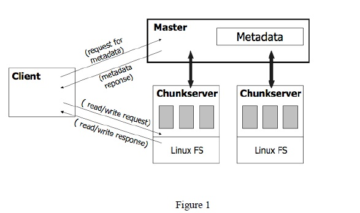

# Google File Systems @ghemawat2003google

文件系统基本接口需要有：创建`Create`、打开`Open`、读取`Read`、删除`Delete`、关闭`Close`、写入`Write`，扩展接口则包括：生成快照`Snapshot`、修改`Update`、追加`Append`等

## 存储设计

- 把文件分为一个个 chunk 来存储。GFS 把每个 chunk 设为 64MB。
- chunk 随机存储在 chunkserver 上，并保留多个备份

## master 设计

- master 保存了所有 chunk 的元数据信息，元数据包括
  - 所有文件和 chunk 的 namespace【持久化】
  - 文件到 chunk 的映射【持久化】
  - 每个 chunk 的位置【不持久化】，因为这个信息可以从 chunkserver 上获取
- Google 选择了单 master 的架构，为了减轻 master 的压力，优化有
  - GFS 所有的数据流都不经过 master，而是直接由 client 和 chunkserver 交互;只有控制流才会经过 master。
  - GFS 的 client 会缓存 master 中的元数据，在大部分情况下，都无需访问 master;
  - 为了避免 master 的内存成为系统的瓶颈，GFS 采用了一些手段来节省 master 的内存，包括增大 chunk 的大小以节省 chunk 的数量、对元数据进行定制化的压缩等。
- master 采用了主从复值的方式实现高可用，复制方式类似[[log]]。为保证高性能采用了流水线和数据流控制流分离。

[//begin]: # "Autogenerated link references for markdown compatibility"
[database systems/logging]: <../../database/database systems/log.md> "logging"
[//end]: # "Autogenerated link references"
