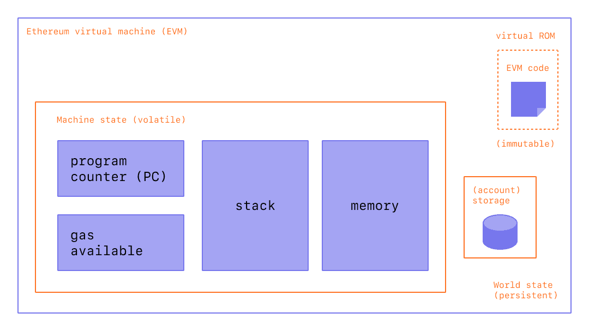

# EVM

以太坊不只是分布式的账本，还是分布式状态机。

以太坊的状态是一个大型数据结构，它不仅保存所有帐户和余额(采用[[Merkle Tree]]实现)，而且还保存一个机器状态，它可以根据预定义的一组规则在不同的区块之间进行更改，并且可以执行任意的机器代码。 在区块中更改状态的具体规则由 EVM 定义。

因而将以太坊定义为状态转移函数$Y(State, Transaction)= State'$更合适

在以太坊上的计算最终要编译为操作码 op code，也可以用[[solidity]]来编写脚本

[//begin]: # "Autogenerated link references for markdown compatibility"
[Merkle Tree]: <Merkle Tree.md> "Merkle Tree"
[solidity]: solidity.md "solidity"
[//end]: # "Autogenerated link references"
