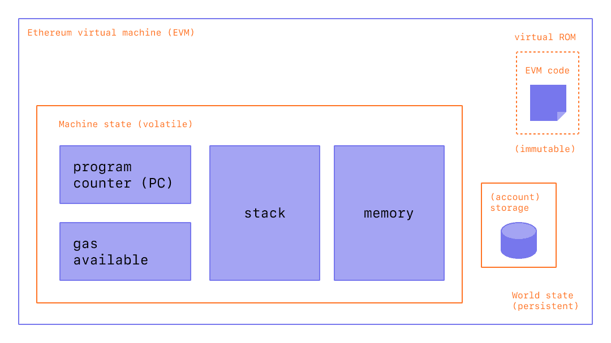

# ethereum

## what can ethereum do

- 属于所有人的银行服务：只要有网络，就可以访问基于以太坊的借贷和储蓄产品
- 更好的隐私保护：使用以太坊应用时您无需提供所有私人信息。以太坊的经济体系构建于价值，而非监管
- P2P 网络：以太坊允许跳过中间商，直接和任何人转移资产或者签订协议
- 反审查：没有政府或者公司拥有以太坊的控制权。去中心化
- 商业保障：客户有一个安全的、内置的保证，即只有在你提供同意的东西的情况下，资金才会易手。同样，开发人员可以确信规则不会改变。
- 所有产品都是可组合的：由于所有应用都构建在相同的区块链上，具有共享的全局状态，因此它们可以相互构建(就像乐高一样)。这使得人们可以一直打造更好的产品和体验。

## ether 以太币

Ethereum 有一种本地加密货币，称为以太 (ETH)。
ETH的供应不受任何政府或公司的控制，新 token 只由维护网络的矿工和储藏者创造。以太网络上的每一项操作都需要一定的计算能力。这笔费用是以 gas 的形式支付的。这意味着至少需要少量的 ETH 才能使用网络。

### PoW & PoS

权益证明 (PoS) 让质押 ETH 不再需要算力。
权益证明 (PoS) 将矿工替换为验证者。 验证者通过质押他们的 ETH 来创建新的区块。
验证者不会竞争创建区块，而是由算法随机选择

矿工被执行相同功能的验证者所取代，区别在于他们没有以计算工作的形式预先花费他们的资产，而是将以太币作为抵押品来防止不诚实的行为。 如果验证者较为懒惰（在应该履行某些验证者职责时离线），他们质押的以太币可能会慢慢流失，而可证明的不诚实行为会导致质押资产遭受“惩罚”。

### gas

gas 费用的多少取决于执行交易所需的算力和全网当时的算力需求。
即使某恶意 dapp 无限循环提交，交易最终也会耗尽 ETH 并终止，从而使网络恢复正常。

当用户为他们的交易支付费用时，网络根据交易需求设置的基础燃料费会被销毁。

## 以太坊账户

- `nonce` – 类似账户 ID
- `balance` – 这个地址拥有的 Wei 数量。$1 ETH=1 \times 10^{18} Wei$。
- `codeHash` - 该哈希表示以太坊虚拟机 (EVM) 上的帐户代码。 合约帐户具有编程的代码片段，可以执行不同的操作。 如果帐户收到消息调用，则执行此 EVM 代码。 所有代码片段都被保存在状态数据库的相应哈希下，供后续检索。对于外部所有的帐户，codeHash 字段是空字符串的哈希。
- `storageRoot` – 有时被称为存储哈希。 Merkle Patricia trie 根节点的 256 位哈希已编码了帐户的存储内容（256 位整数值映射），并编码为 Trie，作为来自 256 的 Keccak 256 位哈希的映射位整数键，用于 RLP 编码的 256 位整数值。 此 Trie 对此帐户存储内容的哈希进行编码，默认情况下为空。

## EVM

以太坊不只是分布式的账本，还是分布式状态机。
以太坊的状态是一个大型数据结构，它不仅保存所有帐户和余额(采用哈希[[树]]实现)，而且还保存一个机器状态，它可以根据预定义的一组规则在不同的区块之间进行更改，并且可以执行任意的机器代码。 在区块中更改状态的具体规则由 EVM 定义。

因而讲以太坊定义为状态转移函数$Y(State, Transaction)= State'$更合适

在以太坊上的计算最终要转化为操作码 op code，也可以用[[solidity]]来编写脚本

[//begin]: # "Autogenerated link references for markdown compatibility"
[树]: ../algorithm/data_structure/树.md "树"
[solidity]: solidity.md "solidity"
[//end]: # "Autogenerated link references"
