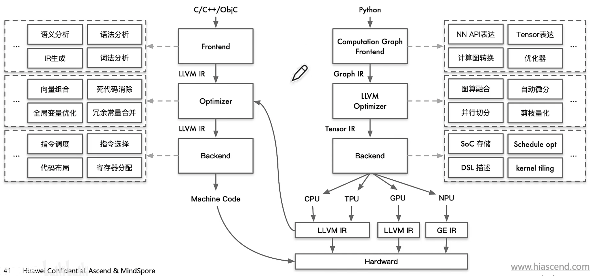

# AI编译器

AI编译器是一个领域特定的编译器，面向[[神经网络]]特定优化计算图，构建在传统编译器之上，

[//begin]: # "Autogenerated link references for markdown compatibility"
[神经网络]: <../../machine learning/concept/神经网络.md> "神经网络"
[//end]: # "Autogenerated link references"
