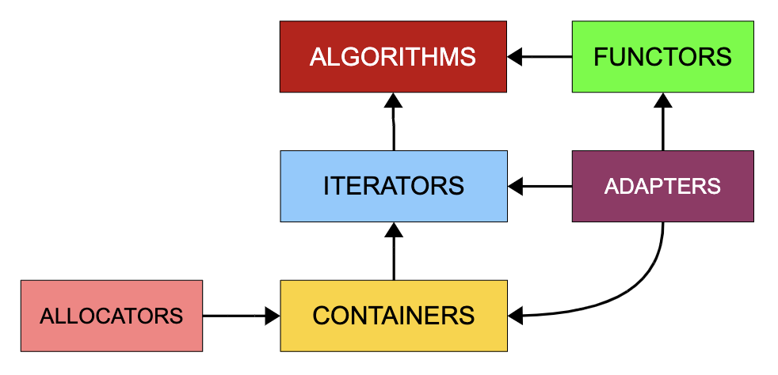

# STL

C++ 的标准模版库 STL 有 6 大类

- containers
- iterators
- algorithms
- adapters
- functors
- allocator

## 容器 containers

### sequence container

- vector：可变长数组
- stack：[[数据结构#栈]]
- queue：[[数据结构#队列]]
- deque：双端队列，分段连续，超过时增加 buffer
- array：数组包裹成 stl 的格式
- list：[[数据结构#链表]]，每次需要增加内存的是两倍大小

### associative container

方便大量查找，包括 set/multiset（key-value 不分） map/multimap（key-value 查询），通常用[[红黑树]]实现

### unordered container

也是一种关联容器，是不定序的容器，[[哈希表]] 的 separate chaining [[链接]]法实现

## 分配器 allocators

不应该直接使用，因为不用容器和手动 malloc free 之外反而更复杂

[//begin]: # "Autogenerated link references for markdown compatibility"
[数据结构#栈]: ../algorithm/数据结构.md "数据结构"
[数据结构#队列]: ../algorithm/数据结构.md "数据结构"
[数据结构#链表]: ../algorithm/数据结构.md "数据结构"
[红黑树]: ../algorithm/data_structure/红黑树.md "红黑树"
[哈希表]: ../algorithm/data_structure/哈希表.md "哈希表"
[链接]: ../csapp/链接.md "链接"
[//end]: # "Autogenerated link references"
