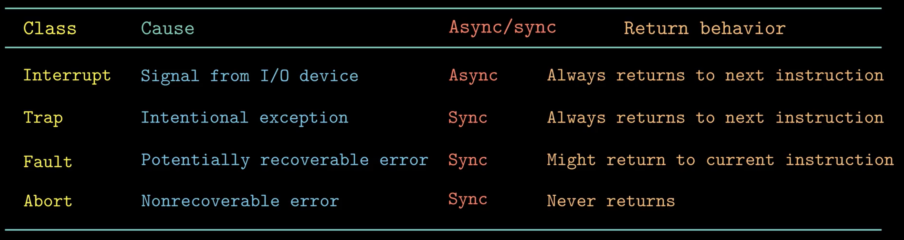

# 并发

并发是交替运行的，并行是同时运行的。并发结果是[[多线程]]，并行结果是[[多进程]]
并发的基本单位是线程，线程共享内存(指针可以相互引用)，但拥有独立的堆栈和寄存器

状态是 global 和 thread，并发程序的状态机每一步都是不确定的，每动一步某个 thread 和 global 状态变化，其他 thread 不变

## 异常控制流

PC 是一个序列，每个元素 a 是某个相应的指令 I 的地址。每次从 $a_i$ 到 $a_{i+1}$ 的过度称为控制转移。这样的控制转移序列叫做控制流

现代系统通过使控制流发生突变来对这些情况做出反应。一般而言，我们把这些突变称为异常控制流（Exceptional Control Flow,ECF)。

异常就是控制流中的突变，用来响应[[处理器]]状态中的某些变化。

## 异常



- 中断 Interrupt 是异步的，发生异常后 CPU 执行异常处理程序返回下一条指令，好像中断从未发生过一样
  - 同步异步指中断指令来自CPU内部还是外部，除中断外都是同步的
- 陷阱 Traps 是故意触发的异常(用于 IO、新建进程)，用户程序 syscall 触发异常执行系统调用返回下一条指令
- 故障 Faults 是由错误情况引起，如果故障处理程序能修复，则修复后重新执行引发故障的指令，否则 Abort
- 中止 Abort 是由不可恢复的致命错误导致的，不返回给程序直接结束

## [[进程]]

进程是一个正在执行的程序的实例。通过进程，程序有独占处理器和内存的假象。
当设置了控制寄存器之后，进程运行在内核态，否则运行在用户态。

上下文 [[context]] 是 内容重新启动一个被强占的进程所需的状态，由一些状态的值描述。

### 进程的创建

父进程通过调用 `fork` 函数创建新的子进程，其特点是

- `fork` 会返回两次：一次返回给父进程，一次返回给子进程
- 并发执行，哪个先打印不确定
- 相同但是独立的地址空间
- 共享文件

```c
#include <stdio.h>
#include <sys/types.h>
#include <unistd.h>
#include <stdlib.h>
int main() {
    pid_t pid;
    int x = 1;
    pid = fork();
    if (pid == 0) {
        // 返回给子进程
        printf("Child x=%d\n", ++x);
        exit(0);
    }
    // 返回给父进程
    printf("Parent x=%d\n", --x);
    exit(0);
}
```

```text
Parent x=0
Child x=2
Parent x=1
```

此外还有 `execve` 和 `waitpid`。
子进程终止时，保持在一个终止的状态(zombie)，直到被父进程回收

### [[Synchronization#信号量]]

通知进程发生了哪些异常情况

## [[Lock]]

用互斥锁保护好数据，消灭数据竞争。可以利用 **动态程序分析** 把锁的顺序做成有向图检查是否有环检查死锁，

[//begin]: # "Autogenerated link references for markdown compatibility"
[多线程]: ../python/多线程.md "多线程"
[多进程]: ../python/多进程.md "多进程"
[处理器]: 处理器.md "处理器体系结构"
[进程]: <../operating system/进程.md> "进程"
[context]: <../operating system/context.md> "上下文切换"
[Synchronization#信号量]: <../operating system/Synchronization.md> "Synchronization"
[Lock]: <../operating system/Lock.md> "Lock"
[//end]: # "Autogenerated link references"
