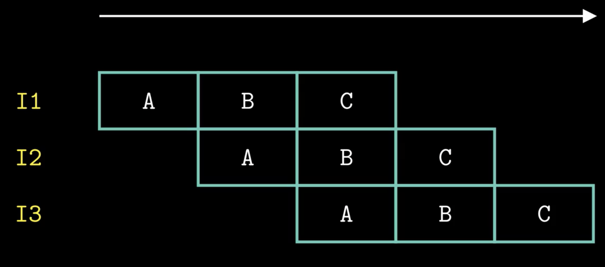

# 处理器体系结构

## 指令执行的基本操作

指令的执行可以分为

- 取址 fetch：必须，计算指令长度
  - 在这一步无法判断指令长度，硬件实现要一次读 10 个字节以保证一条指令全部读进来
- 译码 decode：从寄存器读数据
- 执行 execute：执行逻辑运算、计算内存引用的有效地址、push/pop
- 访存 memory：[[RAM]]读写
- 写回 write back：写寄存器
- 更新 PC Update：程序计数器更新为下一个地址

## 流水线

非流水化的指令必须完成上一条指令后再进行下一条指令，不能相互重叠

当时钟是低电平，时钟寄存器输入不会影响寄存器状态，高电平时才影响。将一个计算过程分解成多个耗时相近的子任务可以加大吞吐量

利用流水线结构，一条指令在取址/.../更新 PC 等过程中，其他指令流水线上开展不同的执行操作，多个指令并行进而加快了指令的执行

### hazard

流水线中的指令存在相互依赖的关系，单纯使用流水线可能会导致从寄存器读出来的值和预期不符

- 解决数据间依赖的方式，除了等待写入到寄存器，还有数据旁路(数据转发)，添加旁路路径转发前面指令的结果；
- 解决控制依赖(返回/跳转指令无法确定下一指令的地址)的方式，除了暂停外还有分支预测

## 处理器层次的优化

### 如何编写高效的程序

- 选择合适的[[数据结构]]与算法
- 理解编译器的能力和局限性
- 大的数据计算任务并行化

度量性能的方式：CPE(每个元素执行所需要的周期数)，减少函数调用次数、消除不必要的内存引用(一直使用的指针变量转化为临时变量)可以优化程序性能

### [[处理器]]指令级并行

现代处理器分为指令控制单元和指令执行单元，可以同时处理多个指令，并且指令是乱序执行的

循环寄存器之间的操作链是限制程序性能的关键操作

### 循环展开

循环索引计算和条件分支预测会减少，进而加速程序运行

如果进一步并行化把不相关的数据分开，计算的关键路径长度剪短，会更快。但过多的并行会导致变量加载在栈上，增加读写内存开销

[//begin]: # "Autogenerated link references for markdown compatibility"
[RAM]: ../../ee/lib/RAM.md "内存"
[数据结构]: ../../algorithm/%E6%95%B0%E6%8D%AE%E7%BB%93%E6%9E%84.md "数据结构"
[处理器]: %E5%A4%84%E7%90%86%E5%99%A8.md "处理器体系结构"
[//end]: # "Autogenerated link references"
