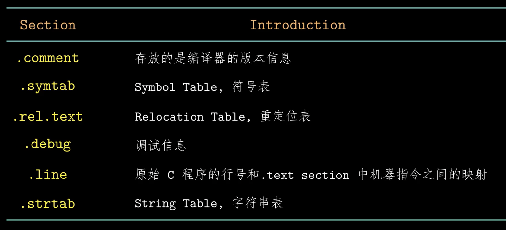
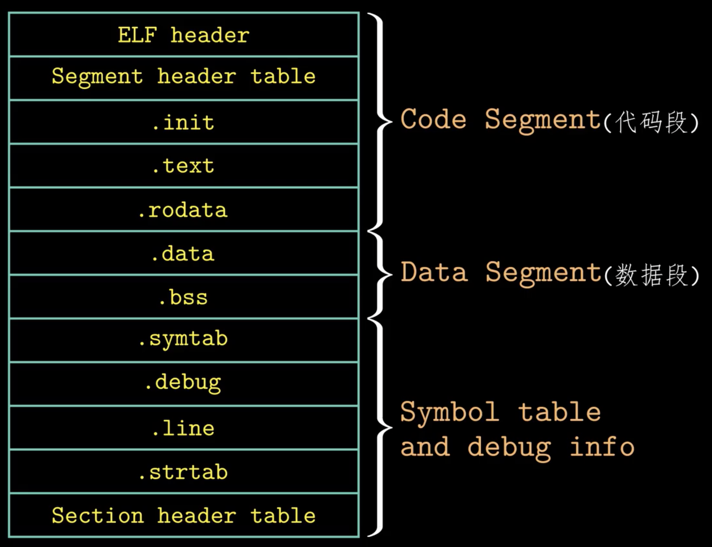

# 链接

## 可重定位目标文件

linux 的可重定位文件可以分成三个部分：

- ELF header：可执行可链接格式文件头，包括一些文件的元信息
- Sections：
  - text：已经编译好的机器代码
  - data：已经初始化的全局变量和静态变量
  - bss：未初始化的全局变量和静态变量，仅仅是一个占位符，不占空间，运行时被初始化为 0
  - rodata：只读数据
  - ：符号表
- Section header table

## 符号解析

[[汇编]]器把强弱信息编码在符号表中。
多个同名的强符号的出现会报错，而一个强符号和多个弱符号不会警告，多个弱符号链接器只会报警

- 强符号：函数和已经初始化的全局变量
- 弱符号：未初始化的全局变量

链接的过程，首先定义三个集合E(链接器扫描时发现的可重定位目标文件，链接完成时合并为可执行文件)、U(引用了但未定义的符号)、D(输入文件中已定义的符号)，链接时扫描目标文件加入 E，并修改 U 和 D，再从静态库文件中继续扫描，把用到的符号加入到 D 并修改 E、U，直至集合 U 变空(如果扫描完非空会报错)

命令行中的目标文件和库文件的输入顺序非常重要，库需要放到命令行的结尾(并(如果库之间相互依赖)排序)

## 重定位

重定位 section，重定位 section 间的符号引用

## 可执行文件

是一个状态机初始状态和迁移的数据结构。
寄存器大部分由 ABI 规定，操作系统负责设置。

[[os]]上的可执行文件需要具有执行权限，且加载器可以识别

### 加载器

是一个 mmap([[进程#进程的地址空间]]) 的系统调用

## 共享库

运行加载时可以被加载到任何内存地址，还能和内存中的程序链接起来

[//begin]: # "Autogenerated link references for markdown compatibility"
[汇编]: 汇编.md "程序的机器级表示"
[os]: <../operating system/os.md> "操作系统"
[进程#进程的地址空间]: <../operating system/进程.md> "进程"
[//end]: # "Autogenerated link references"
