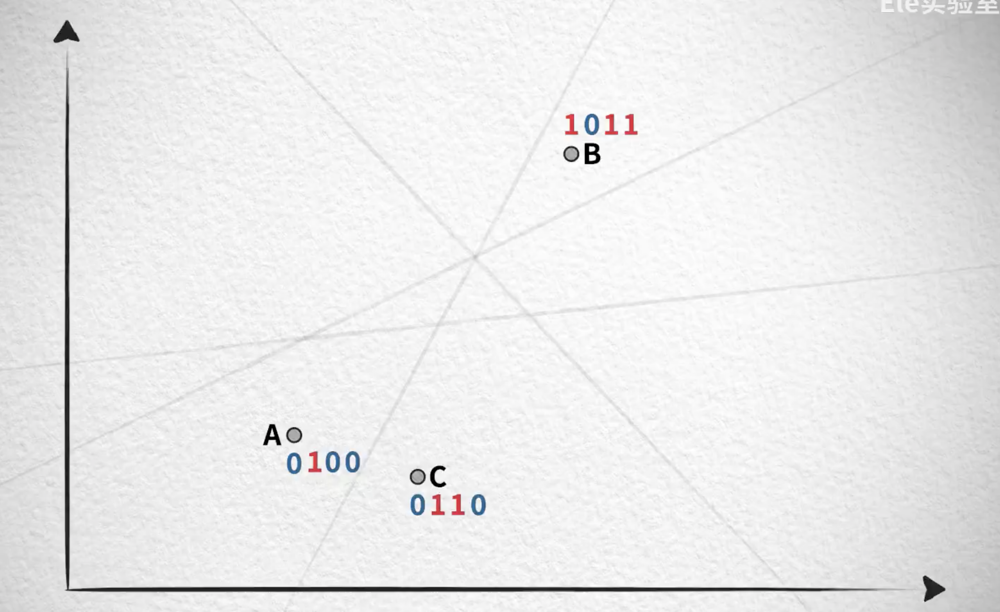

# 向量数据库

不同事物在不同特征维度中有不同的表现/数值，对应高维空间中的坐标点，概念更为接近的事物在高维空间中距离更近。传统数据库以精确匹配为主，IO 密集，而向量数据库以模糊匹配为主，计算密集。

## 应用

- 向量化图片：以图搜图/商品推荐
- 向量化视频：推荐视频
- 向量化文本：找到已经解决过的相似的问题
  - 向量化历史问答：让 LLM 拥有记忆，提问时候找到最相近的历史问题做[[Prompt Engineering]]，提升 LLM 的效果

## 数据库实现难点

核心是找到接近的向量，是模糊查找，而不是精确查找，要使用最近临搜索算法。但存储向量非常多时 KNN 算法的效率会很低

### 搜索速度

解决方法是牺牲部分准确性获得快速的搜索速度，算法有：

- 聚类(近似最近邻 ANN)：先做 K-means，查询时先找质心，再在该范围内 KNN
  - 可能出现遗漏
- 位置敏感[[哈希表]]：类似的向量使其分到同一个 bucket 中，查询时先找 bucket，再在该范围内 KNN。可能出现误判
  - 例如随机用多个超平面分割空间，每个超平面对应一个 bit，向量的每个维度大于超平面则为 1，否则为 0。两个向量相同位数越多则越相似
  - 通常采用分段方式减少误判，不同分段的二进制编码尽量一致

### 内存开销

高维向量的内存开销很大，解决方法是压缩向量，算法有：

- 乘积量化(PQ)：把向量用质心编码表示，极大减少内存开销(~98%)，也能一定程度减少搜索时间
  - 做 K 很大的 K-means，然后用质心点替代所有向量点，从而做到有损压缩
  - 给质心向量编码后，可以用单个编码代替向量(称为 codebook)，从而减少内存开销
  - 量化用 codebook 的内存开销替代了原向量的内存开销，但高维空间由于向量稀疏需要的 K 可能非常大
    - 解决方法是分割向量，把$1\times 128$拆开成四个$1\times 32$再做量化，做成子空间的笛卡尔积

### Navigate Small World 算法

- 建[[图]]：[Delaunay 三角剖分](https://oi-wiki.org/geometry/triangulation/)，满足以下条件：
  - 每个点都有直接连接友节点
  - 如果两个点之间的距离近到一定程度，一定要连接起来形成友节点的关系
  - 在这两个的基础上保证连线最少
- NSW 算法：查询向量时，随机找一个点，然后找其邻居找到更接近的点，不断重复直到找不到邻居距离查询向量更近的点，那这个停止的点就是最接近的点
- NSW 不一定搜索快，HNSW 通过增加层级来加速搜索：第一层为全部的点，越往上层级点越稀疏。查询时先查上面的点，再一层层穿透到最底层，有点类似[[GNN]]层级

## 需要的[[数据库]]功能

- 提供访问接口、访问控制
- [[MVCC]]
- [[database systems/logging]]
- 分布式

[//begin]: # "Autogenerated link references for markdown compatibility"
[Prompt Engineering]: <../../machine learning/concept/Prompt Engineering.md> "Prompt Engineering"
[哈希表]: ../../algorithm/data_structure/哈希表.md "哈希表"
[图]: ../../algorithm/data_structure/图.md "图"
[GNN]: <../../machine learning/concept/GNN.md> "图神经网络"
[数据库]: ../数据库.md "数据库"
[MVCC]: <../database systems/MVCC.md> "MVCC"
[database systems/logging]: <../database systems/log.md> "logging"
[//end]: # "Autogenerated link references"
