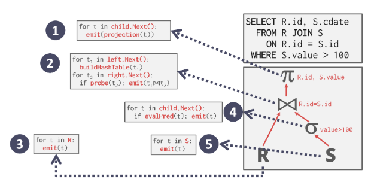
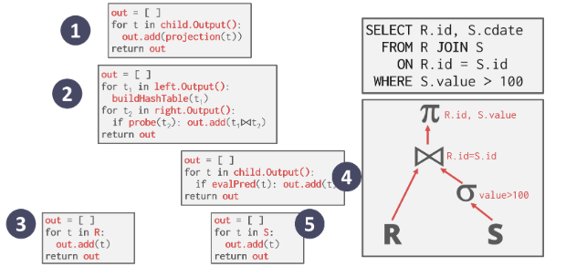
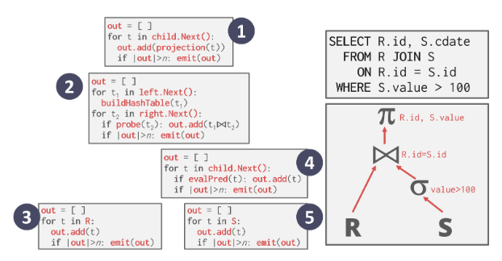

# sql query

## query processing

DBMS 将[[sql]] 语句转换为查询计划。
查询计划中的运算符排列在树中。
数据从这棵树的叶子流向根部。
树中根节点的输出是查询的结果。
运算符是二元的(1-2个子运算符)，可以通过多种方式执行相同的查询计划

### processing model

DBMS 执行 query 的方式，可以自顶而下或自底而上地执行

#### Iteration model

row-based DBMS 使用，
某些算子是会阻塞流水线的，比如`join`，`order by`，`subquery`。

每个操作符都实现了一个 `next` 函数，`next` 函数本质上是遍历其子运算符的输出的for循环。循环结束后发送一个 null pointer 告知父节点可以前进

#### Materialization model

适合 OLTP，
是特殊的 [[#Iteration model]]，每个操作符一次处理它的所有输入，然后一次输出它的所有输出。每个运算符在每次到达时都返回其所有元组，而不是让Next函数返回单个元组。

#### Victorized/Batch model

适合 OLAP，并且容易被 SIMD 所向量化。
类似[[#Iteration model]]但每次返回的是一个 batch

### access model

DBMS 从表中取得信息的方式，可以是

- 从表中按顺序取
  - 迭代每个 page 然后从 [[buffer_pools]] 中取出来，然后看是否满足条件，优化方式包括
    - prefetching：同时取后面几页免避 IO 阻塞
    - buffer pool bypass：结果存到 local memory 来避免 flooding
    - 并行
    - Zone Map
    - Late Materialization
    - Heap Clustering
- 从[[index]]中取，扫描索引判断是否满足条件

## [[并发]]查询

[//begin]: # "Autogenerated link references for markdown compatibility"
[sql]: sql.md "mysql"
[#Iteration model]: sql执行.md "sql query"
[buffer_pools]: buffer_pools.md "buffer pools"
[index]: index.md "索引"
[并发]: ../csapp/并发.md "并发"
[//end]: # "Autogenerated link references"
