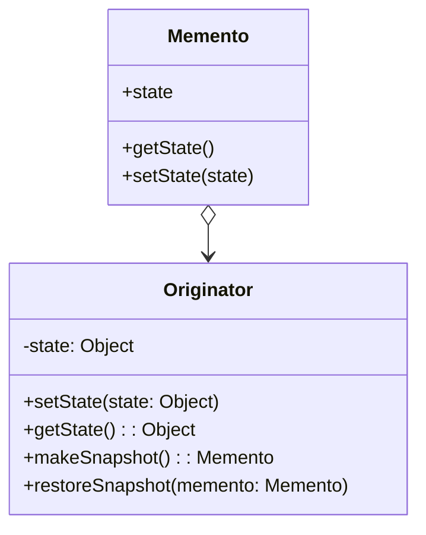

# 备忘录模式

允许在不暴露对象实现细节的情况下保存和恢复对象之前的状态。做快照的方式为在对象中添加`makeSnapshot()`的方法自行保存状态，然后在需要恢复时调用`restoreSnapshot()`方法。

```mermaid
classDiagram
    class Memento {
        +state
        +getState()
        +setState(state)
    }
    class Originator {
        -state: Object
        +setState(state: Object)
        +getState(): Object
        +makeSnapshot(): Memento
        +restoreSnapshot(memento: Memento)
    }
    Memento o--> Originator
```
