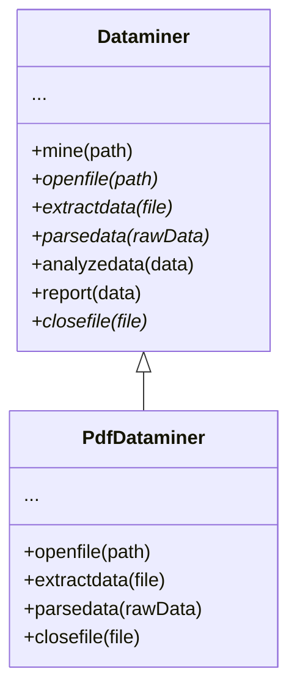

# 模版

在超类中定义了一个算法的框架，允许子类在不修改结构的情况下重写算法的特定步骤。

多个类的重复步骤可以抽出为模版方法，步骤分为三类：

- 抽象方法：由子类实现，子类必须根据需要重写。
- 钩子方法：由子类实现，子类可以根据需要重写，但是默认实现已经足够好。
- 可选方法：由子类实现，子类可以根据需要重写，但是默认实现不够好，需要子类重写。

```mermaid
classDiagram
%% mine()为模版方法，其余为步骤
    class Dataminer {
        ...
        +mine(path)
        +openfile(path)*
        +extractdata(file)*
        +parsedata(rawData)*
        +analyzedata(data)
        +report(data)
        +closefile(file)*
    }
    class PdfDataminer {
        ...
        +openfile(path)
        +extractdata(file)
        +parsedata(rawData)
        +closefile(file)
    }
    Dataminer <|-- PdfDataminer
```
