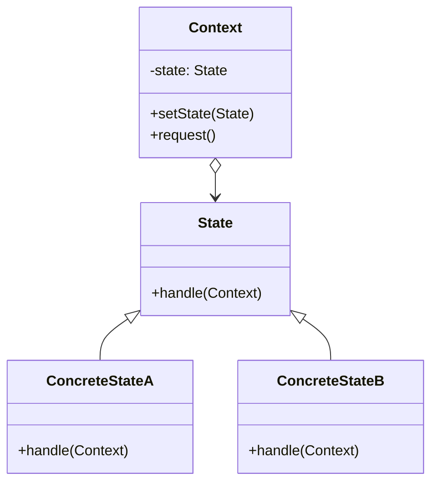

# 状态模式

在一个对象的内部状态变化时改变其行为，使其看上去就像改变了自身所属的类一样。为对象的所有可能状态新建一个类，然后将所有状态的对应行为抽取到这些类中。

```mermaid
classDiagram
    class Context {
        -state: State
        +setState(State)
        +request()
    }
    class State {
        +handle(Context)
    }
    class ConcreteStateA {
        +handle(Context)
    }
    class ConcreteStateB {
        +handle(Context)
    }
    State <|-- ConcreteStateA
    State <|-- ConcreteStateB
    Context o--> State
```
