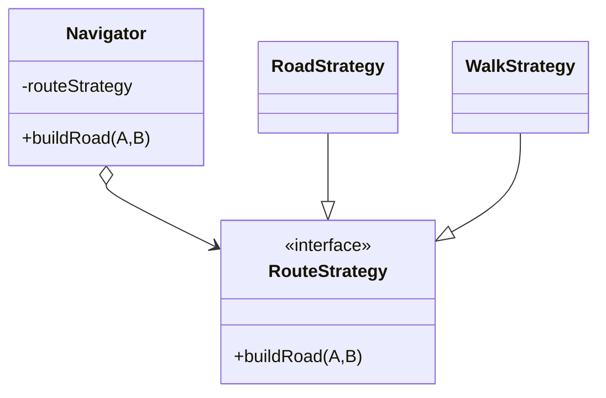

# 策略模式

定义一系列算法，并将每种算法分别放入独立的类中，以使算法的对象能够相互替换。

```mermaid
classDiagram
    class Navigator{
        -routeStrategy
        +buildRoad(A,B)
    }
    class RouteStrategy{
        <<interface>>
        +buildRoad(A,B)
    }
    Navigator o--> RouteStrategy
    RoadStrategy --|> RouteStrategy
    WalkStrategy --|> RouteStrategy
```
