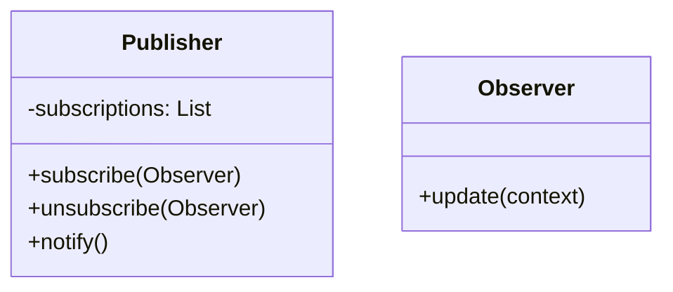

# 观察者模式

观察者模式处理发布者和订阅者之间的关系，建议为发布者类添加订阅机制，让每个对象都能订阅或取消订阅发布者事件流。发布者调用 `notify()` 方法时，会调用`Observer`的`update`。

```mermaid
classDiagram
    class Publisher {
        -subscriptions: List<Observer>
        +subscribe(Observer)
        +unsubscribe(Observer)
        +notify()
    }
    class Observer {
        +update(context)
    }
```
