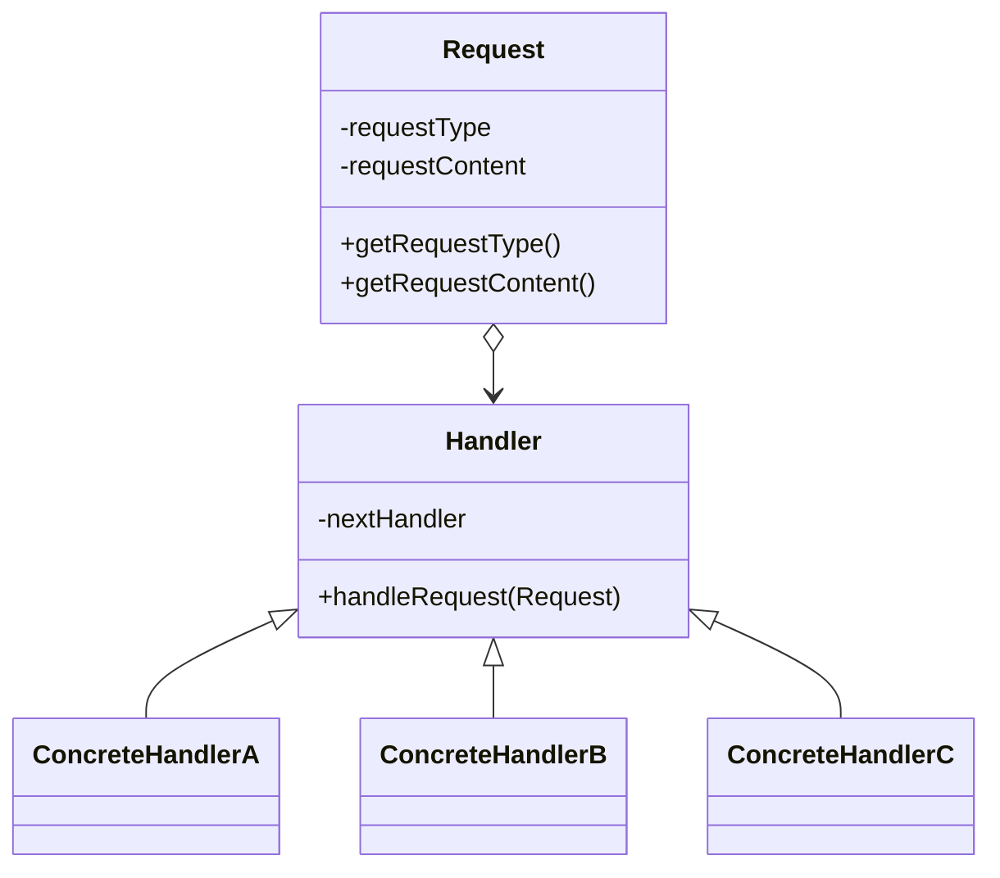
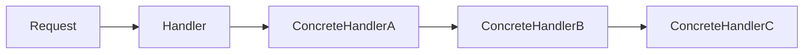

# 责任链模式

责任链模式是一种行为设计模式，允许你将请求沿着处理者**链**进行发送。收到请求后，每个处理者均可对请求进行处理，或将其传递给链上的下个处理者。

```mermaid
classDiagram
    class Request{
        -requestType
        -requestContent
        +getRequestType()
        +getRequestContent()
    }
    class Handler{
        -nextHandler
        +handleRequest(Request)
    }
    Request o--> Handler
    Handler <|-- ConcreteHandlerA
    Handler <|-- ConcreteHandlerB
    Handler <|-- ConcreteHandlerC
```

```mermaid
graph LR
    A[Request] --> B[Handler]
    B --> C[ConcreteHandlerA]
    C --> D[ConcreteHandlerB]
    D --> E[ConcreteHandlerC]
```
