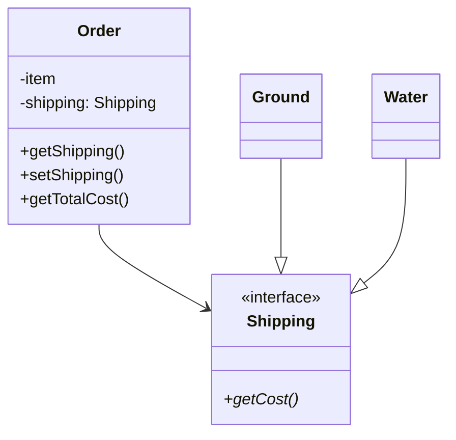

# 开闭原则

对于扩展，类应该是“开放”的；对于修改，类则应是“封闭”的，即在需求发生变化的时候，在不修改源代码的基础上扩展组件

实现的方式是接口/抽象类

```mermaid
classDiagram
    class Order{
        -item
        -shipping: Shipping
        +getShipping()
        +setShipping()
        +getTotalCost()
    }
    class Shipping{
        +getCost()*
    }
    <<interface>> Shipping
    Order--> Shipping
    Ground --|> Shipping
    Water --|> Shipping
```
