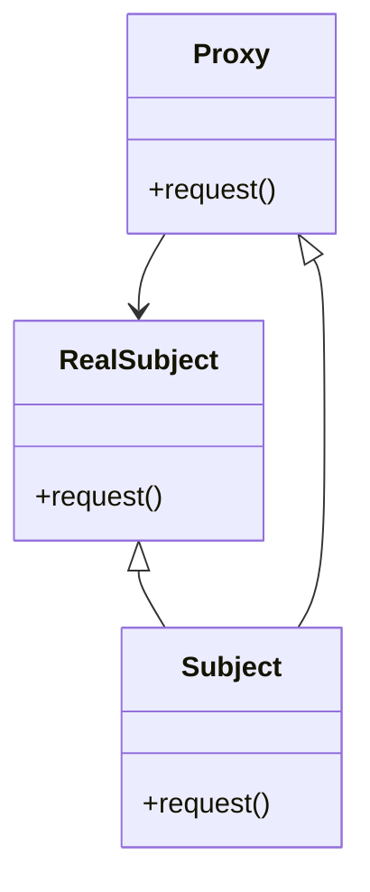

# 代理模式

对类进一步封装，以控制对它的访问。代理模式可以为其他对象提供一种代理以控制对这个对象的访问。

```mermaid
classDiagram
    class Subject {
        +request()
    }
    class RealSubject {
        +request()
    }
    class Proxy {
        +request()
    }
    RealSubject <|-- Subject
    Proxy <|-- Subject
    Proxy --> RealSubject
```
