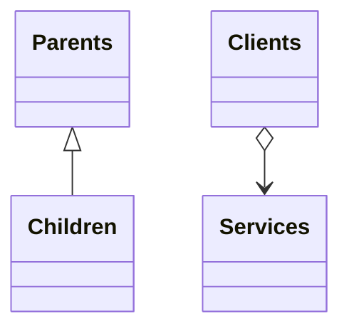

# 装饰器模式

将对象放入包含行为的特殊封装对象中来为原对象绑定新的行为。

```python
class TextTag:
    def __init__(self, text: str) -> None:
        self._text = text
    def render(self) -> str:
        return self._text

class BoldWrapper(TextTag):
    def __init__(self, wrapped: TextTag) -> None:
        self._wrapped = wrapped
    def render(self) -> str:
        return f"<b>{self._wrapped.render()}</b>"
```

不是通过继承来扩展对象的功能，而是通过组合来实现。


