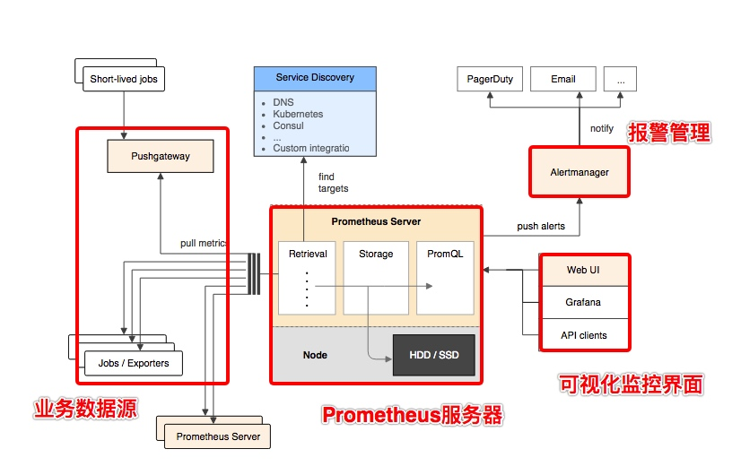

# Prometheus

用于监控系统和服务的开源监控系统和时间序列数据库

## 架构


整个 Prometheus 可以分为四大部分，分别是：

- Prometheus 服务器：Prometheus 组件中的核心部分，负责实现对监控数据的获取，存储以及查询。
- NodeExporter：通过 Pull/Push 两种方式推送数据到 Prometheus Server，底层是[[http]]
- AlertManager：Prometheus 通过配置报警规则，如果符合报警规则，那么就将报警推送到 AlertManager，由其进行报警处理
- 可视化监控界面

## Metric 指标

Prometheus 中主要有四种不同的指标类型，用来适应不同的指标类型。

- counter 计数器，适用于例如机器开机时间、HTTP 访问量等数值
- gauges 计量器，适用于例如硬盘容量、CPU 内存使用率等数值
- histogram 柱状图，反应数值的分布情况，适用于例如请求延迟、请求大小等数值
- summary 汇总，常用来表示类似于：请求持续时间、响应大小的信息

在 Prometheus 中抓取数据的应用叫做实例（Instance），而几个为了同个目的的实例组合起来称之为任务（Job）。例如下面是一个有 4 个实例的服务工作。

```yaml
job: api-server  // 名为api-server的job
    instance 1: 1.2.3.4:5670
    instance 2: 1.2.3.4:5671
    instance 3: 5.6.7.8:5670
    instance 4: 5.6.7.8:5671
```

一个任务（Job）可以有多个实例（Instance），一个实例上可以有多个指标（Metric），一个指标只会有一个指标类型（Metric Type）

[//begin]: # "Autogenerated link references for markdown compatibility"
[http]: ../network/application/http.md "http"
[//end]: # "Autogenerated link references"
