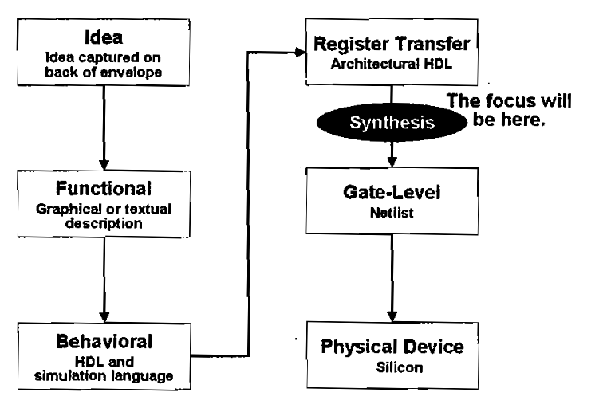

# 数字电路

## [[CMOS]]

## 逻辑门与电路

- 与门、或门、非门、异或门、与非门、或非门
- 逻辑电路的组合：
  - [[组合逻辑电路]]：ALU 的加减法、比较其实是逻辑门的组合，或者说真值表的组合
  - [[时序逻辑电路]]：时钟信号的作用，触发器、寄存器、计数器等

## 芯片设计流程

- functional：描述功能、验证性能
- behavioral：用 HDL 模拟设计(通常并不常用，由 EDA 完成)，HDL 有 [[Verilog]] 和 VHDL 两种
- register transfer：将 HDL 转化为 RTL(描述了电路的寄存器和拓扑及组合逻辑)
- synthesis：综合，将 RTL 转化为门级电路网表

## 约束

- 时序约束：RTL 不包含时序信息，综合后的电路需要满足时序约束，即时序约束是对电路的时序行为的描述
- 面积约束

[//begin]: # "Autogenerated link references for markdown compatibility"
[CMOS]: CMOS.md "CMOS"
[组合逻辑电路]: %E7%BB%84%E5%90%88%E9%80%BB%E8%BE%91%E7%94%B5%E8%B7%AF.md "组合逻辑电路"
[时序逻辑电路]: %E6%97%B6%E5%BA%8F%E9%80%BB%E8%BE%91%E7%94%B5%E8%B7%AF.md "时序逻辑电路"
[//end]: # "Autogenerated link references"
