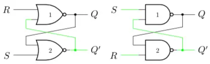

# 时序逻辑电路

## 锁存器 Latch

- 能够存储一个状态的电路叫做锁存器
- 对于所有锁存器，都有一个时钟信号，当时钟信号为高电平时，锁存器开始工作，当时钟信号为低电平时，锁存器停止工作

### RS 锁存器

为了让电路拥有自己的“状态”，必须要有某种反馈机制，将输出输入形成一个闭环

它有两种稳定状态，对于所有的锁存器，都有 $Q$ 和 $Q'$ 两个输出，且它们必定相反。

利用与非门或者或非门实现 RS 锁存器，R 为 Reset，S 为 Set，R 和 S 不能同时为 1

### RS 锁存器的改进

- 门控 RS 锁存器加入时钟信号 CLK 后，当 CLK 信号为高时，锁存器会像普通锁存器一样工作；CLK 信号为低，则无论输入为什么，状态都会被保持。这样，计算机就可以在时钟为低时做计算，并准备好所有要写入的信号，然后在时钟信号为高时写入。
- D 锁存器更简单，只有一个输入，即数据输入，没有 Reset 和 Set 输入，只有时钟信号
- JK 锁存器更全面，相比于 RS 的保存、置 1、置 0，JK 锁存器还有一个切换状态的功能，即当 J 和 K 同时为 1 时，状态会切换

### 应用

- 定时器：组合比较器和锁存器，可以实现定时器，频率取决于定时器中的电阻电容

## 触发器 Flip-Flop

锁存器是一种对脉冲电平（也就是 0 或者 1）敏感的存储单元电路，而触发器是一种对脉冲边沿（即上升沿或者下降沿）敏感的存储电路

## 寄存器

寄存器由触发器组成
