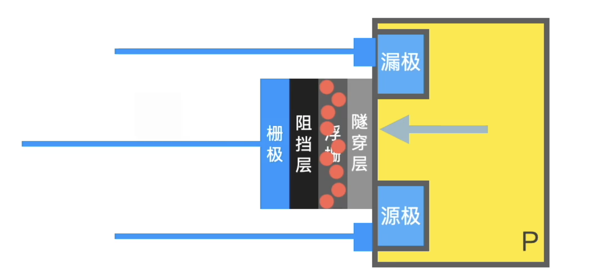

# Flash 闪存

## EEPROM

- 电子可擦除可编程只读存储器，擦除方式是高电平
- [[#Flash]]都是 EEPROM 的一种，但性能比[[RAM]]差

## Flash

通过把电子锁在浮栅层来存储数据

### NOR

将晶体管并联

### NAND

将晶体管串联

[//begin]: # "Autogenerated link references for markdown compatibility"
[#Flash]: Flash.md "Flash 闪存"
[RAM]: RAM.md "内存"
[//end]: # "Autogenerated link references"
