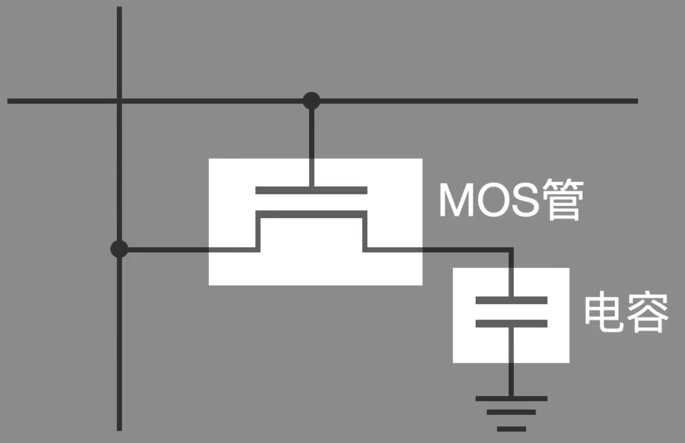
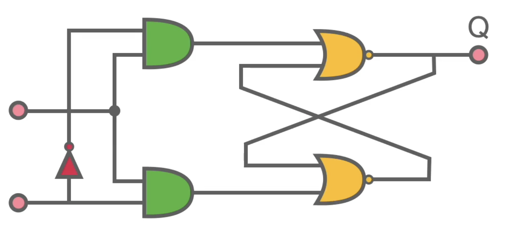

# 内存

## DRAM

- 由一个电容+一个[[cmos]]构成，电容存储 1 或 0，CMOS 用来控制读取和写入
- 电容可能会漏电，所以需要不断刷新

## SRAM

- 由一个[[时序逻辑电路#RS 锁存器]]和与门构成，RS 锁存器存储 1 或 0
- 不需要刷新

[//begin]: # "Autogenerated link references for markdown compatibility"
[cmos]: ../electronics/digital/CMOS.md "CMOS"
[时序逻辑电路#RS 锁存器]: ../electronics/digital/%E6%97%B6%E5%BA%8F%E9%80%BB%E8%BE%91%E7%94%B5%E8%B7%AF.md "时序逻辑电路"
[//end]: # "Autogenerated link references"
