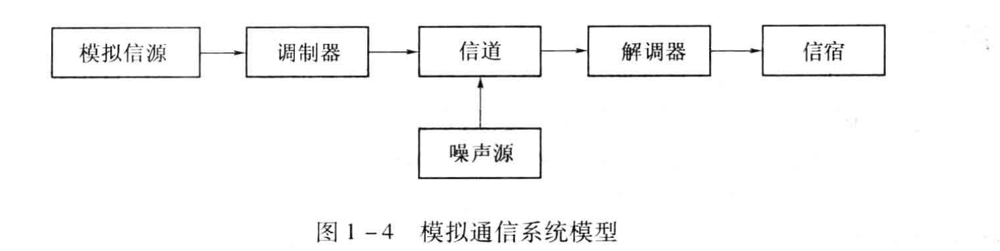
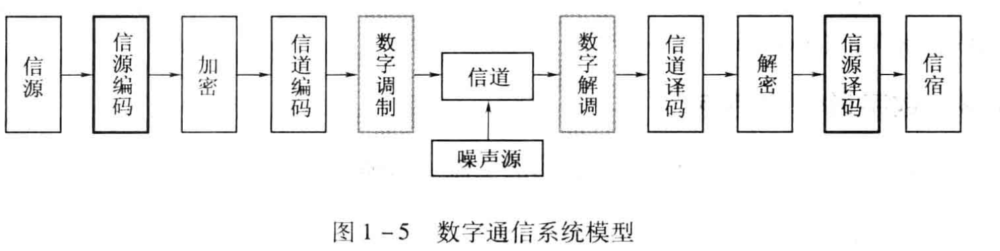

# TODO 通信原理

## [[信息论]]

## 通信基本概念

- 模拟通信系统
  - 两种基本变换：基带信号的生成和解析、调制和解调
- 数字通信系统
  - !
  - 信源编码与译码：压缩减少码元数目，完成[[数字电路]]/[[模拟电路]]转化
  - 信道编码与译码：差错控制
  - 数字调制与解调：把数字基带信号的频谱搬移到高频处, 形成适合在信道中传输的带通信号
- 频谱：信号的频率分布特性，即信号[[快速傅立叶变换]]或傅立叶展开得到的频谱图

[//begin]: # "Autogenerated link references for markdown compatibility"
[信息论]: %E4%BF%A1%E6%81%AF%E8%AE%BA.md "信息论"
[数字电路]: ../electronics/digital/%E6%95%B0%E5%AD%97%E7%94%B5%E8%B7%AF.md "数字电路"
[模拟电路]: ../electronics/analog/%E6%A8%A1%E6%8B%9F%E7%94%B5%E8%B7%AF.md "TODO 模拟电路"
[快速傅立叶变换]: ../../algorithm/algorithms/%E5%BF%AB%E9%80%9F%E5%82%85%E7%AB%8B%E5%8F%B6%E5%8F%98%E6%8D%A2.md "快速傅立叶变换"
[//end]: # "Autogenerated link references"
