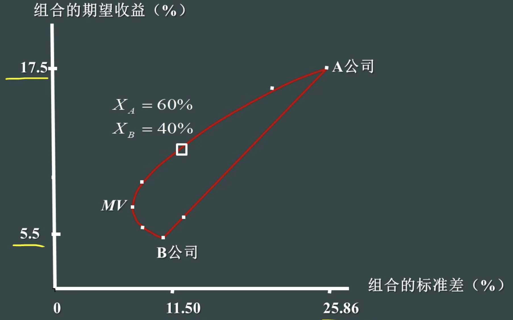

# CAPM

## Markowitz 组合理论

资金在两种资产间完全分配，组合标准差-期望收益的轨迹形成可行集(A-B的曲线)。
可行集中位于最小方差之上的部分称为有效集(MV之上的部分)

> 实际与预期收益之间的差别为风险，可以分为系统性或非系统性风险。系统性风险无法通过分散消除。

如果有无风险借贷，即加入无风险资产(位于(0,r))，那么最后组合会落在经过无风险资产的切线上，这条切线叫 资本市场线 CML，所有投资者的 CML 是一样的，切点 M 也是一致的

## CAPM 模型

> 分散化消除非系统性风险，得到多元化后对单个证券的估值

把[[#Markowitz 组合理论]]的 CML 逆推，可以得到
$$
R_i=\alpha_i+\beta_i R_M+\varepsilon_i
$$
这条线称为证券特征线 SML

CAPM 模型中市场期望收益
$$
\bar{R}_M=R_F+市场风险溢价
$$
单个证券的期望收益
$$
\bar{R}_i=R_F+\beta_i(\bar{R}_M-R_F)
$$
$\beta$系数说明了股票收益对系统性风险的反应有多大，受收入的周期性、财务杠杆和经营杠杆影响
> 经营杠杆反应固定资本的敏感性，放大经济周期对$\beta$的影响，$DOL=\frac{EBIT+FC}{EBIT}$
> 财务杠杆反应债务融资的依赖程度，$\beta_E=\beta_A(1+\frac{B}{S}(1-t))$(因为债务$\beta$为0)

## APT 模型：套利定价模型

> [[有效市场]]中套利机会很快会消失

对单一证券
$$
R_i=\bar{R}_i+m+\varepsilon_i
$$
其中把市场风险$m$因子分解为
$$
R_i=\bar{R}_i+\sum \beta_{ij}F_j+\varepsilon_i
$$
其中每个因子为实际-预期。
从而组合的期望收益可以写成$R=\bar{R}+\beta F$

[//begin]: # "Autogenerated link references for markdown compatibility"
[#Markowitz 组合理论]: CAPM.md "CAPM"
[//end]: # "Autogenerated link references"
