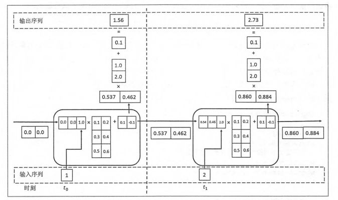

# 经典算法

CNN 和 RNN 现在很多用来作为[[神经网络]]的一层

## CNN

### 卷积


$$(f*g)(t)=\int_{\mathbb{R}^n}f(\tau)g(t-\tau)\mathrm{d}\tau$$

### 池化

增强稳健性

### 代码

```python
class CNN(nn.Module):
    def __init__(self) -> None:
        super(CNN, self).__init__()
        self.conv = nn.Sequential(
            nn.Conv1d(48, 20, 3,padding=2, stride=1),
            # 输入特征48个1维指标，20个卷积核，每个核大小为3，左右各补两个，每次滑动一格
            nn.Tanh(),
            nn.AvgPool1d(3),
            # 池化采用取平均值，卷积扫出来是三个（2+1+2=5，5-2=3），20层
        )
        self.fc = nn.Sequential(
            nn.Linear(20, 7),
            # 20 层转化为 7 维
            nn.ReLU(),
            nn.Softmax(dim=1),
        )

    def forward(self, x):
        out = self.conv(x)
        out = out.view(out.size(0), -1)
        out = self.fc(out)
        return out
```

### 扩展

1. AlexNet：CNN 开山之作，重点是防止过拟合
2. ResNet：只有训练得好才走网络，否则不走。拟合残差函数 $h(x)-x$

## RNN



很多被 [[transformer]] 取代，权值共享，有“记忆”功能。

- 难以并行，计算性能差
- 过去的隐藏状态可能会被丢掉

### LSTM

- 忘记门 F：将值朝 0 减小
- 输入门 I：决定是否忽略输入数据
- 输出门 O：决定是否用隐状态

cell 的状态不仅有隐藏层 h，还有一个 $C_t=F_t\bigodot C_{t-1}+I_t\bigodot \tilde{C}_t$ ，$\tilde{C}_t$ 是根据 输入和 H 算出来的
h 由 C 和 O 决定

[//begin]: # "Autogenerated link references for markdown compatibility"
[神经网络]: 神经网络.md "神经网络"
[transformer]: transformer.md "Transformer"
[//end]: # "Autogenerated link references"
