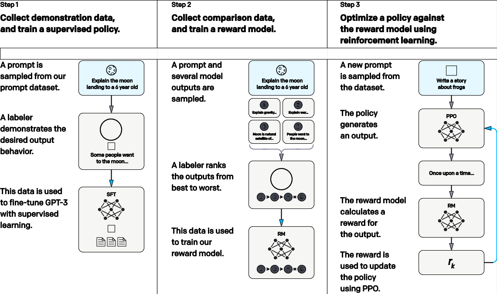

# RLHF

大力出奇迹的模型存在有效性和安全性的问题，[[GPT]]-3 可能会胡说、生成质量和营销号类似。ChatGPT 的解决方法是加入一些标注的数据做“监督学习”，即采用利用人类反馈下的强化学习 (RLHF) 增强回答质量，让 AI 学会说 “我不知道/我不会说”。在 RLHF 的加持下，ChatGPT 比 GPT-3 小 100 倍， 但是效果不比 GPT-3 差。RLHF 的步骤是:

1. 人力标注一小部分问答数据集，在这一小部分问题上微调 GPT-3 回 答类似于人力标注的回答，微调结果称为 SFT。但是人力标注很贵， 并且总有标注未覆盖到的地方，因此 ChatGPT 继续做了下面两件事
2. 对某些问题，GPT 重复生成多个答案，并由人力排序。针对这些排序 的数据集训练一个新的神经网络 RM，学习如何排序打分
3. 微调 SFT，只不过微调的目标变成了让 RM 给的分数最大 (这是强化 学习的标准做法)

[//begin]: # "Autogenerated link references for markdown compatibility"
[GPT]: ../model/GPT.md "GPT"
[//end]: # "Autogenerated link references"
