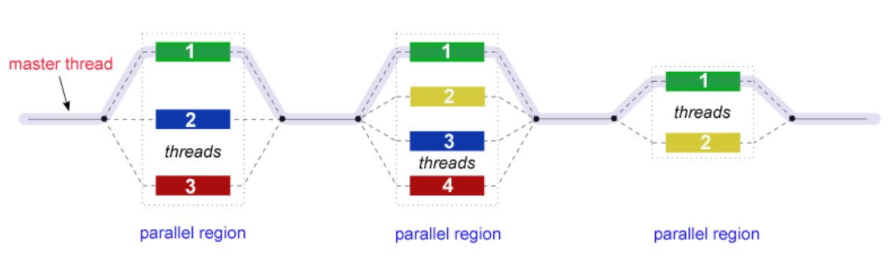

# OpenMP

OpenMP 基于共享内存模型，传统上利用 OpenMP 进行单机器 CPU 优化，较新的 OpenMP 版本可以直接使用 OpenMP 将代码优化到 GPU 等异构计算设备上

## 并行模型

OpenMP 的并行只使用 Fork-Join 一种模型


- OpenMP  程序开始于一个主线程，按照顺序执行，直到遇到第一个并行块
- fork：主线程创建一组并行线程
- join：当团队线程完成并行块中的语句时，它们将进行同步并终止，只留下主线程
- 并行块的数量和组成它们的线程是任意的

### 常见编译器指令

- `#pragma omp parallel`：创建并行块
- `#pragma omp for`：并行化  for  循环
- `#pragma omp master`：只有主线程执行
- `#pragma omp single`：仅有团队中一个线程执行
- `#pragma omp sections`：内部使用  section  指定不同线程运行的内容
- `#pragma omp barrier`：同步团队中所有线程
- `#pragma omp atomic`：原子方式访问内存

```cpp
#include <omp.h>
#include <stdio.h>
#include <stdlib.h>
int main() {
    // 创建并行块来并行运行同一段程序
    #pragma omp parallel
    {
        int ID = omp_get_thread_num();
        printf("thread #%d\n", ID);
    }
    // 将for循环拆成不同部分分配给多个线程
    #pragma omp parallel
    {
        #pragma omp for
        {
            for (int i = 0; i < N; ++i) {
                c[i] = a[i] + b[i];
            }
        }
    }
}
```
