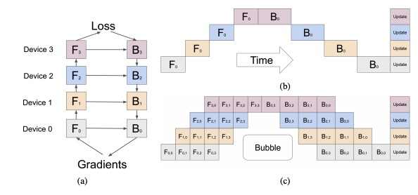
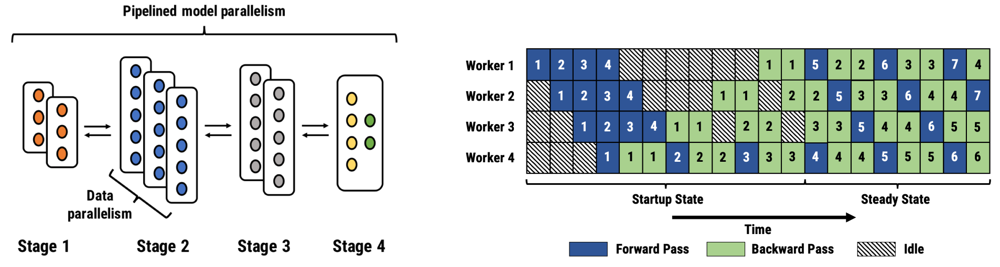

# GPipe

## 流水线并行

把网络分成多个不同的 Stage，每个 Stage 在不同的 GPU 上计算，然后把结果传给下一个 GPU，这样就可以实现流水线并行。

## Micro-Batch

> 压缩空载时间 Bubble

把 Batch 拆分，每一个 Micro-Batch 在这一层计算完之后就传给下一层计算，所有的 Micro-Batch 计算完之后再进行梯度更新。

## Re-Materialization

反向计算的时候，依赖于前向计算的中间结果($wx$、$\sigma(wx)$等)，但是前向计算的结果在传给下一层之后就会被释放，所以需要把前向计算的结果缓存下来，但内存有限。

Re-Materialization 认为计算很快，所以可以不要缓存，直接重新计算，因此只保存输入的$x$，输出重新计算即可。

## PipeDream

流水线并行还是存在一定的 Bubble，PipeDream 使用 1F1B 的结构，把 Bubble 压缩到最小。
