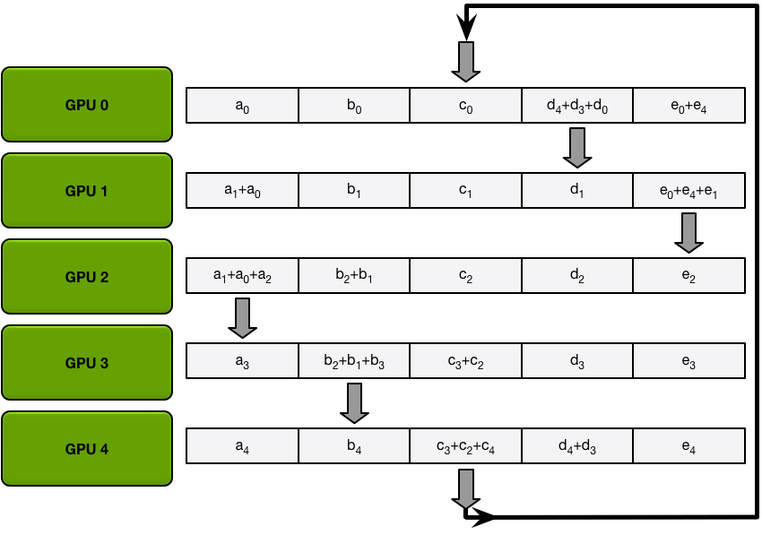

# Parameter Server

> 类似[[MapReduce]]，分布式大模型如何进行并行计算。

## 过程

- 每个机器拿到各自的数据，然后在小 batch 内计算各自的梯度
- 把梯度传给 Parameter Server，Parameter Server 把梯度加起来
- 再把加起来的梯度传给每个机器，每个机器再用这个梯度更新自己的模型。

## Ring AllReduce

> 环同步类似共识算法，保证每个机器的模型是一样的

环同步算法是半异步的，只用遍历两次环就可以实现不同机器的同步，并动态调整同步的频率，步骤是：

- Scatter Reduce：每个机器把自己的模型$(a_i,b_i,c_i)$发给下一台的机器，由下一个机器把参数加起来，然后再发给下一个机器
  - 遍历完一个环后，每个机器都有一部分参数的和，如$(\sum a, \sum b - b_n)$
- All Gather：环执行一遍广播数据

[//begin]: # "Autogenerated link references for markdown compatibility"
[mapreduce]: ../../bigdata/hadoop/MapReduce.md "MapReduce @dean2008mapreduce"
[//end]: # "Autogenerated link references"
