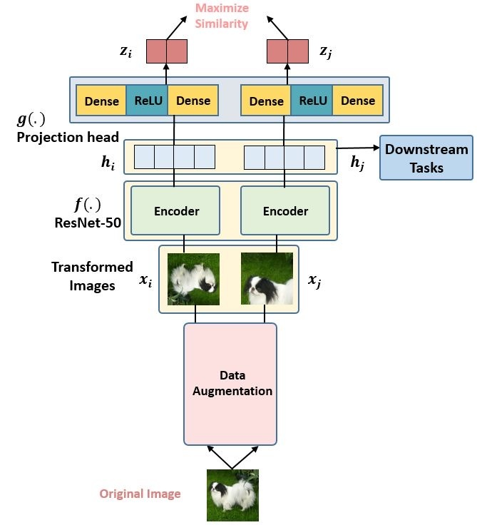

# represent learning

对比学习的思想在于，通过一些已编码的query（q），使其与其对应的key（k）相对应，k是被编码的样本的在字典中的key。
假设q与K相匹配，对比损失的目的是尽量拉近q与K之间的距离而增大与其他$k_i$之间的距离（拉近正对，缩小负对，其他的都是负对）

## MoCo

MoCo 利用了`动量`的思想，用一个又大又一致的字典可以提高对比学习的效率

把一张图片利用分割成两个 augment，训练两个 encoder 分别计算出 k 和 q，对正和负对计算损失来传播更新这两个 encoder。传播的过程中更新方式为 $\theta_t=m \theta_{t-1}+(1-m)\theta_q$，即会把新的数据放进去同时，旧的数据保留一个动量部分

