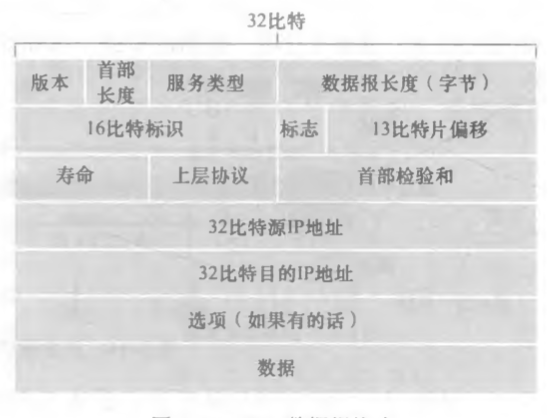

# IP

网络层提供了单一的服务：best-effort service。路由器可以通过查找转发表来决定数据包的下一跳，路由器的工作原理是数据平面和控制平面的结合。DHCP 协议用于动态分配 IP 地址。

## 数据平面

是路由器的功能，进行数据转发，偏硬件

### 路由器工作原理

路由器由四个组件构成

- 输入端口：终结物理链路，查询转发表决定输出端口
- 交换结构：连接输入和输出端口
- 输出端口：传输发送
- 路由选择处理器：执行路由选择协议和网络管理

  路由器匹配可以采用最长前缀匹配规则，决定从哪个端口输出

### IPv4 与 IPv6

IPv4 数据报里面，寿命保证了这个数据报不会永远在网络里。IPv6 不允许路由器分片，而 IPv4 则利用 标识、标志和片偏移的字段允许分成小的片

形式为`a.b.c.d/x`的 IPv4 地址前 x 位 bit 为网络地址，后 32-x bit 用于区分组织内部的设备，首部有 x 个 1 的 32 位二进制数称为子网掩码。网络中的主机地址可以采用 DHCP 协议动态分配。IPv4 地址短缺

使用 NAT 来给只有一个公有 IP 的私有网络服务。IP 地址中预留了 3 个私有地址网段(A/B/C 类的开头)，在私有网络内，可以任意使用。私网和公网各自使用独立的地址空间。私网使用私有地址如 10.0.0.0/24，而公网使用公网地址。为了让主机 A 和 B 访问互联网上的服务器 Server ，需要在网络边界部署一台 NAT 设备(路由器或防火墙)用于执行地址转换，这个路由器作为[[LAN]]内的代表。

IPv6 扩大了地址容量，分片不再被需要，校验和决定在传输层解决

## 控制平面

路由选择协议，偏软件。路由是网中如何找到一条比较好的路径

### 路由选择算法

- 全局算法：LS 算法，本质是获得网络拓扑和代价之后，运用[[最短路径#Dijkstra]]算法，过程中需要不断转发分组信息
- 分布式算法：DV 算法，每个路由器维护一张路由表，定时和邻居交换路由表并更新

  实现包括 RIP、OSPF、自治区之间的 BGP 等协议

### 软件定义网络

ODL、ONOS 等协议实现

[//begin]: # "Autogenerated link references for markdown compatibility"
[LAN]: ../datalink/LAN.md "局域网"
[最短路径#Dijkstra]: ../../algorithm/algorithms/%E6%9C%80%E7%9F%AD%E8%B7%AF%E5%BE%84.md "最短路径"
[//end]: # "Autogenerated link references"
