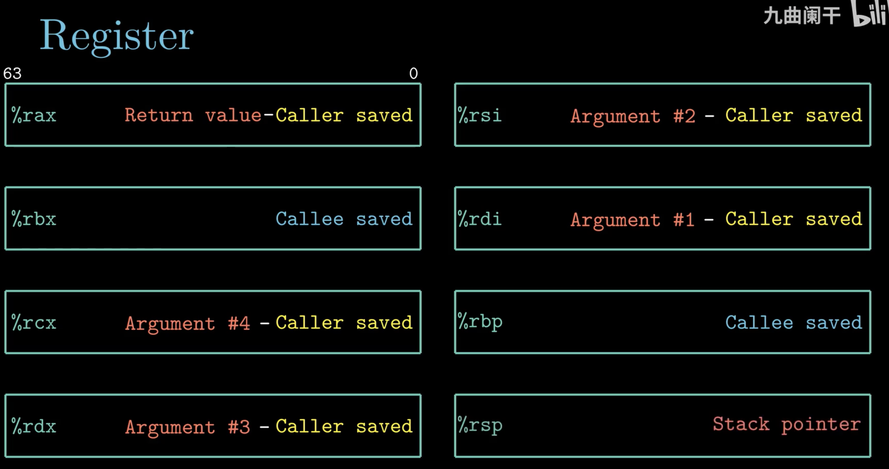

# 计算机组成

## CPU

### 结构

1. Program Counter

    记录当前指令的地址，4/8字节的地址空间，开机之后 PC 始终指向当前命令地址

2. Register

    暂时储存需要用的数据，临时存放数据的空间；intel 有 16 个通用寄存器存放整数数据和指针

    汇编有 *调用者保存寄存器* 和 *被调用者保存寄存器* 两种
    

3. ALU

    运算逻辑单元，复制寄存器的数值，计算后覆盖到寄存器

4. CU

    控制单元，控制中断信号

5. MMU

    内存管理单元

6. Cache

    三级缓存，容量逐级增大，速度逐级减少

## 内存

从 0 开始的大数组，每个字节有自身的地址。每个进程看到的空间都是一样的“虚拟地址空间”，虚拟内存空间如下图所示。
虚拟内存给进程体现的假象是所有内存为其所用。

## 总线

传送固定长字符串的字节块，连接
