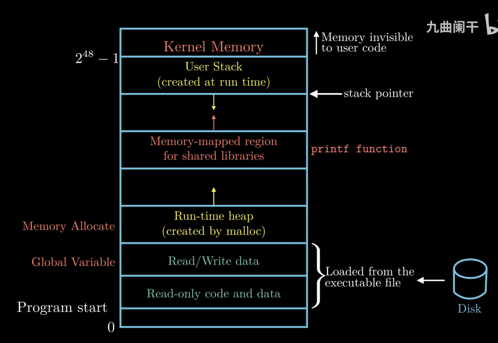

# 计算机结构

## 程序执行的过程

虚拟内存给进程体现的假象是所有内存为其所用。



栈帧中保存程序执行所需要的重要信息

## 汇编视角

基于条件传送的代码比基于跳转指令的代码效率高，因为处理器利用了流水线。

计算机中的循环是通过条件测试与跳转的组合实现的。处理 `switch` 语句的时间与测试数量无关

地址对齐的原则：任何 K 字节的基本对象的起始地址必须是 K 的倍数

## 汇编语言

## `movq`

```asm
movq dst, src
-- src = dst
```

there can be

-   immediate: constant integer data with $ like $0x400
-   register: one of integer registers like %rax
-   memory: memory at address, like %(rax)

you can&rsquo;t `movq` memory from memory for safety, but you can read and copy.

## `leaq`

memory addressing D(Rb, Ri, S) finds Mem(Reg(Rb)+S\*Reg(Ri)+D)

```asm
leaq src, dst
-- dst = memory adressing(src)
```
