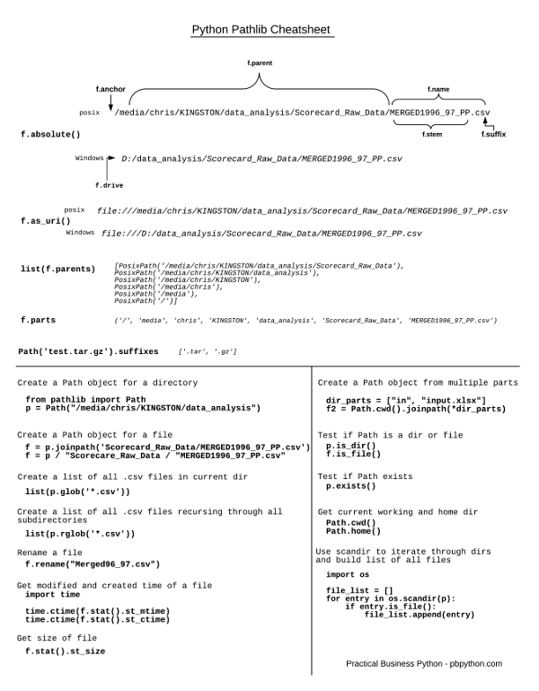

# python

## features

- 3.3 `yield from xs`, venv
- 3.4 `asyncio`, `enum`, [[#pathlib]]
- 3.5 `async/await`([[协程]]), typing
- 3.6 f-string, `[i async for i in aiter() if i % 2]`
- 3.7 [[#dataclass]]
- 3.8 `(x := read()) + 1`, `f'{x=}'`
- 3.9 `string.removesuffix()`, `val: list[int] = []`, graphlib
- 3.10 `with (A() as a, B() as b)`, [[#match]]

### pathlib

pathlib 重载了 `/` 运算符


### dataclass

it will make the class comparable, (imuttable, hashable)

```python
from dataclasses import dataclass, field
@dataclass(frozen=True) # hashable and imuttable
class Comment:
    id: int = field()
    text: str = field(default="")
```

### match

`match` like `switch` but with `break`, using `case`. case `_` matches all cases.

## [[meta programming]]

## 上下文管理器

避免 IO 过程中出现错误没有释放资源

### 类的方法实现

只要实现了 `__enter__` 和 `__exit__` 方法，就可以用 `with` 来管理

### 方法实现

`@contextmanager` 这个 decorator 接受一个 generator，用 yield 语句把 with &#x2026; as var 把变量输出出去，然后，with 语句就可以正常地工作了：

```python
from contextlib import contextmanager

@contextmanager
def my_open(path, mode):
    f = open(path, mode)
    """__enter__"""
    yield f
    """__exit__"""
    f.close()
with my_open("file","w") as f:
    f.write(123)
```

[//begin]: # "Autogenerated link references for markdown compatibility"
[#pathlib]: python.md "python"
[协程]: 协程.md "协程"
[#dataclass]: python.md "python"
[#match]: python.md "python"
[meta programming]: <meta programming.md> "元编程"
[//end]: # "Autogenerated link references"
