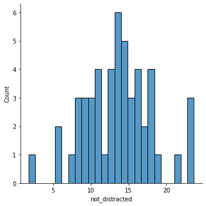
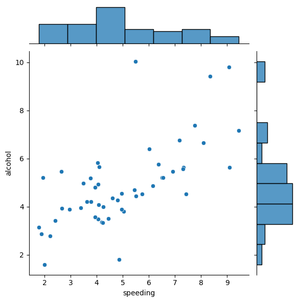
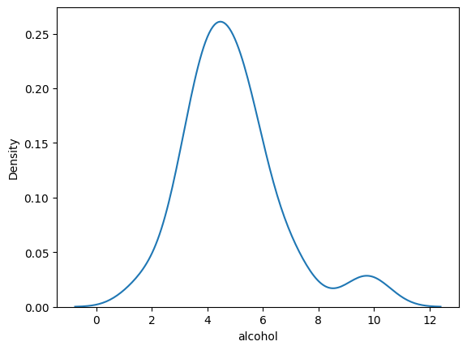
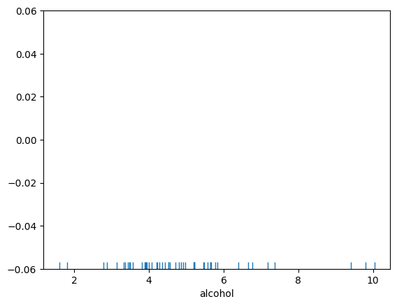
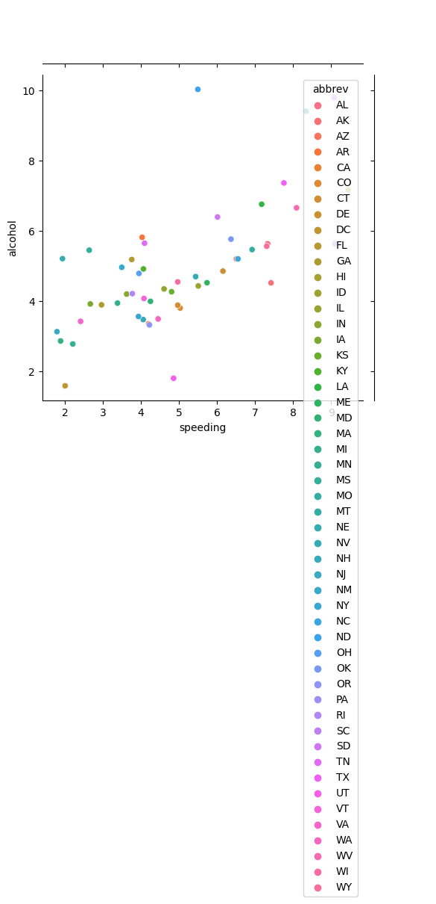

# [[python]] 数据分析

```python
import pandas as pd
import numpy as np
import matplotlib.pyplot as plt
import seaborn as sns
import statsmodels.api as sm
import statsmodels.formula.api as smf
```

## numpy

numpy 是底层为 C 的向量计算库，是 [[python]] 科学计算的基石，快速、贴近底层。

中文文档：<https://www.numpy.org.cn/> 英文文档：<https://numpy.org/doc/stable/user/index.html>

非常的底层，数值计算的基础

### numpy 基础数据类型

NumPy 包的核心是 ndarray 对象，是一种容器，类似于 python 的 list 和 C++ 的 array 。 它封装了 python 原生的同数据类型的 n 维数组，为了保证其性能优良，其中有许多操作都是代码在本地进行编译后执行的。

ndarray 有固定的大小、容器中是相同的数据类型（可以通过 dtype 访问）。 ndarray 通过 **矢量化** 加速程序运行

```python
arr = np.array([1,2,3,np.nan])
print(arr.astype(float))
print(arr.dtype)
```

请注意 numpy 的整数有可能溢出

#### 数组的创建

1.  从其他 Python 结构（例如，列表，元组）转换

    `np.array(list_like)`

2.  numpy 原生数组的创建

    numpy 提供了部分函数，可以创建特定的数组
    
    ```python
    shape = (1, 4)
    print(np.ones(shape))
    print(np.zeros(shape))
    print(np.random.random(shape))
    print(np.arange(0, 6, 2)) # 从0到6，每隔2个
    print(np.linspace(1., 4., 6)) # 从1到4，一共6个
    ```

### 索引与变形

shape 属性储存了 numpy 数组的“形状”，并且是可以修改的

```python
x = np.arange(10)
x.shape = 2, 5
print(x)
print(x[0])
print(x[0:2])
```

### 运算

#### 算术运算符

数组上的算术运算符会应用到 **元素** 级别。下面是创建一个新数组并填充结果的示例：

```python
a = np.array( [20,30,40,50] )
b = np.arange( 4 )
c = a-b
print(c)
print(c**2)
print(10*np.sin(a))
print(a<35)
```

对于矩阵，乘法使用@

```python
A = np.array([[0, 1], [2, 3]])
B = np.array([[4, 5], [6, 7]])
print(A*B)
print(A@B)
```

#### 一些方法

axis 参数可以指定操作的方向，沿着第几维

```python
x = np.array([[3, 1, 4, 1], [5, 9, 2, 6]])
print(x.min())
print(x.max())
print(x.mean(axis=0))
print(x.sum())
print(x.argmax())
print(x.cumsum(axis=1))
print(np.fromfunction(lambda i, j: i == j, (3, 3), dtype=int))
# The resulting array has a value fn(x, y, z) at coordinate (x, y, z).
```

#### 广播

广播允许通用功能以有意义的方式处理不具有完全相同形状的输入。

广播的第一个规则是，如果所有输入数组不具有相同数量的维度，则将“1”重复地预先添加到较小数组的形状，直到所有数组具有相同数量的维度。

广播的第二个规则确保沿特定维度的大小为1的数组表现为具有沿该维度具有最大形状的数组的大小。假定数组元素的值沿着“广播”数组的那个维度是相同的。

## pandas

pandas 封装了 [[#numpy]] 的一些操作，使得 [[python]] 可以像操作 excel （其实是基于 R 的语法）一样操作数据（称为 [3.1.2]）

中文文档：<https://www.pypandas.cn/docs/getting_started/10min.html> 英文文档：<https://pandas.pydata.org/docs/>

### 对象

#### `Series`

可以理解成一列 excel 数据

#### `DataFrame`

可以理解成一张 excel 表，可以用切片/属性的方式访问某一列

```python
dates = pd.date_range('20130101', periods=6)
df = pd.DataFrame(np.random.randn(6, 4), index=dates, columns=list('ABCD'))
print(df.columns)
print("===")
print(df)
print("===")
print(df.T)
print("===")
print(df.A)
```

1.  dataframe 的导入导出

    导入可以用 `pd.read_*` ，而导出可以用 `pd.to_*` ，如 csv, excel

2.  查看数据

    df 有属性 `head(n)`, `tail(n)` 可以查看头/尾 n 条数据
    
    `describe()` 可以快速查看数据的统计摘要：
    
    ```python
    desc = df.describe()
    print(desc)
    print(desc['A'])
    
    ```

3.  切片

    一个 [] 切出来是一个 Series，两个[[]] 则是 dataframe
    
    ```python
    df["A"] # return the column A as Series
    df[["A", "B"]] # return column AB as a new df
    ```

4.  排序

    ```python
    print(df.sort_values(by = ['A', 'B'], ascending=False))
    ```

5.  筛选

    向量化操作会更快，条件中间用&
    
    ```python
    print(df[df["A"]<0])
    ```

6.  运算

    运算基本类似 numpy ，但是没有广播机制，必须对齐
    
    特别的，有 `apply` 函数很常用
    
    `df.apply(lambda x: x.max() - x.min())`
    
    `apply` 的含义是，对每一个 Series ，应用这个函数，并返回结果

7.  合并

    两个 dataframe 合并，操作中 how 必须是 One of &rsquo;left&rsquo;, &rsquo;right&rsquo;, &rsquo;outer&rsquo;, &rsquo;inner&rsquo;. Defaults to inner.
    
    ```python
    left = pd.DataFrame({'key': ['foo', 'bar'], 'lval': [1, 2]})
    right = pd.DataFrame({'key': ['foo', 'bar', "etc"], 'rval': [4, 5, 6]})
    
    print(pd.merge(left, right, on="key", how="left"))
    ```

8.  `group_by`

    return (group, df<sub>in</sub><sub>group</sub>)
    
    ```python
    df = pd.DataFrame(
        {
            "A": ["foo", "bar", "foo", "bar", "foo", "bar", "foo", "foo"],
            "B": ["one", "one", "two", "three", "two", "two", "one", "three"],
            "C": np.random.randn(8),
            "D": np.random.randn(8),
        }
    )
    print(df.groupby("A").sum())
    ```

### 其他

#### `dropna`

`df.dropna()` 删除掉空值

#### `cut`

```python
df = pd.DataFrame({0:[i for i in range(100)]})
cutted = pd.cut(df[0], bins=[-1, 50, 101])
print(cutted)
```

#### `value_counts`

```python
print(cutted.value_counts())
```

#### 透视表

1.  `pivot_table`

    有四个最重要的参数 index、values、aggfunc
    
    1.  index
    
        针对不同的索引构建透视表
        
        ```python
        pd.pivot_table(df,index=['a', 'b'])
        ```
    
    2.  values
    
        values 可以对需要的计算数据进行筛选
    
    3.  aggfunc
    
        aggfunc 参数可以设置我们对数据聚合时进行的函数操作，默认是 mean

2.  `pivot`

    ```python
    df.pivot(index="row as", columns="column as", value="show what value")
    ```

#### `stack`

将一个 multiIndex 的多列变成一个更加 multiIndex 的一列

`unstack` 是相反的过程

## statsmodels

可以视作 stata 的替代品，也有部分机器学习算法（目前机器学习最流行的框架是 pytorch ）

文档：<https://www.statsmodels.org/stable/gettingstarted.html>

### 回归

```python
df = sm.datasets.get_rdataset("Guerry", "HistData").data # data loader, use pandas
x = df[['Literacy', 'Wealth']]
y = df['Lottery']
model = sm.OLS(y, x)
result = model.fit()
print(result.summary())
# print(result.summary().as_latex())
```

#### 获得参数

```python
print(result.params)
print(result.rsquared)
print(result.pvalue)
```

### formula

```python
import statsmodels.formula.api as smf

smf.ols(formula="A~B+np.log(C)-1", data=df).fit().summary()
```

支持 R 风格的公式

-   \\~ 代表 \\=
-   - 明晰不要某个变量：-1代表无截距项
-   : 代表两个的交互项
-   \* 代表两个的交互项，此外还有他们两个单独的项
-   可以使用 np 的函数等

### 其他

<https://www.statsmodels.org/stable/examples/notebooks/generated/ordinal_regression.html?highlight=logistic>

## matplotlib

https://matplotlib.org/stable/tutorials/index

基础的作图，对标 Matlab

### 中文

```python
plt.rcParams['font.sans-serif']=['SimHei'] #用来正常显示中文标签
plt.rcParams['axes.unicode_minus']=False
```

### example

pyplot 是 matplotlib 暴露给我们的接口，可以用 plt.plot 作图

教程：<https://matplotlib.org/stable/tutorials/introductory/pyplot.html>

```python
import matplotlib.pyplot as plt
import numpy as np
x = np.linspace(-5,5,100)
y = np.sin(x)
plt.plot(x,y)
filename="plts/example.png"
plt.title("example")
plt.xlabel("X")
plt.savefig(filename)

```


### 具体

| 折线图 | 直方图 | 散点图  | 饼图 |
| plot | bar | scatter | pie |

## seaborn

seaborn 是封装了 matplotlib 的又一层接口，相较 matplotlib 默认更美观

教程：<https://seaborn.pydata.org/tutorial.html>

### basics

#### matplotlib use seaborn style

```python
plt.style.use("seaborn")
# or
sns.set()
```

#### init

```python
import seaborn as sns
crash_df = sns.load_dataset("car_crashes", data_home="./cache/")
crash_df.head(3)
```

       total  speeding  alcohol  not_distracted  no_previous  ins_premium  \
    0   18.8     7.332    5.640          18.048       15.040       784.55   
    1   18.1     7.421    4.525          16.290       17.014      1053.48   
    2   18.6     6.510    5.208          15.624       17.856       899.47   
    
       ins_losses abbrev  
    0      145.08     AL  
    1      133.93     AK  
    2      110.35     AZ  

### plots

#### `distplot`

```jupyter-python
sns.displot(crash_df["not_distracted"], bins=25)
```



#### `jointplot`

```jupyter-python
sns.jointplot(x='speeding',y='alcohol', data=crash_df) # kind='reg','hex'
```


#### `kdeplot`

kde: 核密度估计

```jupyter-python
sns.kdeplot(crash_df['alcohol'])
```




#### `pairplot`

```jupyter-python
sns.pairplot(crash_df)
```


#### `rugplot`

```jupyter-python
sns.rugplot(crash_df["alcohol"])
```

    <AxesSubplot:xlabel='alcohol'>



#### others

-   `barplot`
-   `countplot`

### options

#### hue

点着色

```jupyter-python
sns.jointplot(x='speeding',y='alcohol', data=crash_df, hue='abbrev') # kind='reg','hex'
```




## sympy

`sympy` 用于符号计算

### 基本符号表示

```python
import sympy
sympy.init_printing(use_unicode=True, wrap_line=True)
x = sympy.Symbol('x')
y = sympy.Symbol('y')
sympy.oo  # ∞
sympy.pi.evalf()
```


### 代数运算与解方程

```python
sympy.expand((x + y)**3)
sympy.simplify((x + x*y) / x)
sympy.solve([x**2-1, x+y],[x,y])
```


### 微积分

### 极限

```python
sympy.limit(sympy.sin(x)/x, x, 0)
```


### 微分

```python
sympy.diff(sympy.sin(x), x)
```


Taylor 展开

```python
sympy.series(sympy.E**x,x)
```


### 积分

```python
sympy.integrate(x**2, x)
sympy.integrate(x**2, (x,0,1))
sympy.integrate(sympy.exp(-x**2), (x, -oo, oo))
```
