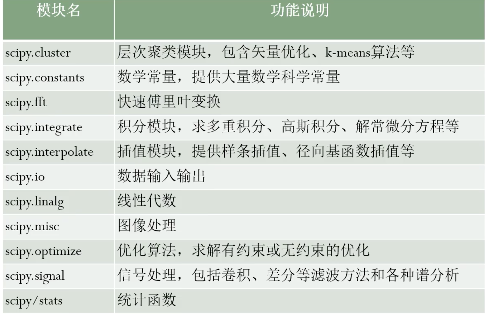

# scipy

scipy是[[python]]的一个科学计算库，相关的工具封装在子模块中。使用时 `from scipy imports xxx`



## integrate

### quad 积分

下面为 $\int_0^2x^2\mathrm{d}x$，二重积分用 `dblquad`

```python
from scipy import integrate

def myfunc(x, n):
    return x**n

print(integrate.quad(myfunc, 0, 2, args=2)[0])
```

## optimize

### minimize

从 2，4 开始猜最小值

```python
from scipy import optimize
def f(w):
    x,y=w
    return (x-3)**2+y**2
# 限制范围大于0
bns = ((0,None),(0,None))
cons = ({"type":"ineq", "fun": lambda w: w[0]+w[1]-4},)
print(optimize.minimize(f, (2,4), bounds=bns, constraints=cons))
```

```text
     fun: 0.5000000000000009
     jac: array([1.00000001, 1.00000001])
 message: 'Optimization terminated successfully'
    nfev: 12
     nit: 4
    njev: 4
  status: 0
 success: True
       x: array([3.5, 0.5])
```

### fsolve

```python
from scipy.optimize import fsolve
def func(w):
    x,y = w
    return [x * np.cos(y) - 4,
            x * y - y - 5]
root = fsolve(func, [1, 1])
root # array([6.50409711, 0.90841421])
```

## interpolate

插值

## TODO stats

[//begin]: # "Autogenerated link references for markdown compatibility"
[python]: python.md "python"
[//end]: # "Autogenerated link references"
