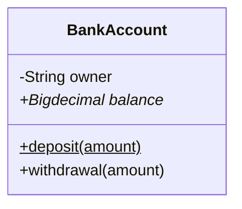
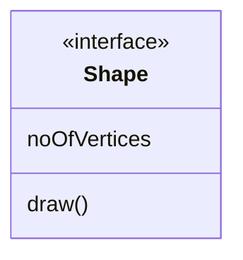
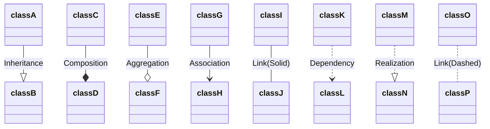

# UML类图

## 类图表示法

UML类图中具体类、抽象类、接口和包有不同的表示方法

### 类

- 矩形框分为三层：第一层是类名字。第二层是类的成员变量；第三层是类的方法。
- “+”表示 `public`；
- “-”表示 `private`；
- “#”表示 `protected`；
- 不带符号表示 `default`。
- 抽象类名及抽象方法用斜体表示，静态方法下划线

### 接口

顶端用构造型 <\<interface>>表示，下面是接口的名

## 类图关系

