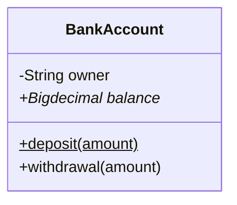
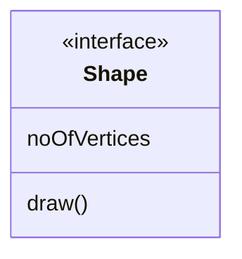
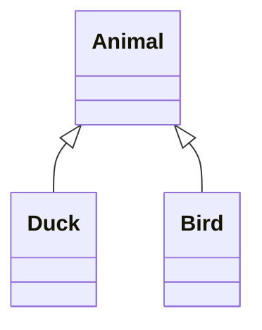
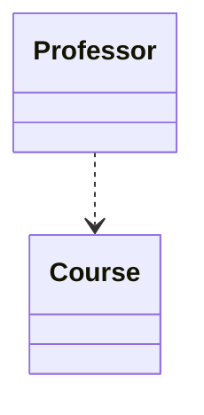
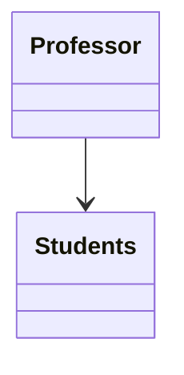
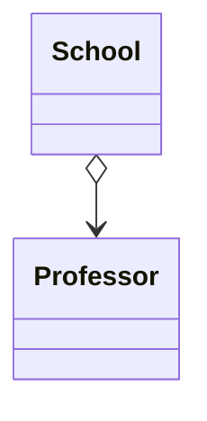
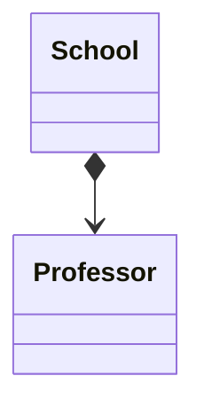

# UML类图

## 类图表示法

UML类图中具体类、抽象类、接口和包有不同的表示方法

### 类

- 矩形框分为三层：第一层是类名字。第二层是类的成员变量；第三层是类的方法。
- “+”表示 `public`；
- “-”表示 `private`；
- “#”表示 `protected`；
- 不带符号表示 `default`。
- 抽象类名及抽象方法用斜体表示(*)，静态方法下划线(\$)

### 接口

顶端用构造型 <\<interface>>表示，下面是接口的名

## [[oop#对象之间的关系]]

### 继承和实现

### 依赖

如果修改一个类的定义可能会造成另一个类的变化，那么这两个类之间就存在依赖关系。[[UML]]图不会展示所有依赖

### 关联

一个对象使用另一对象或与另一对象进行交互的关系(`professor.student.learn(professor.course)`)

### 聚合

聚合是一种特殊类型的关联， 用于表示多个对象之间的“一对多”、“多对多”或“整体对部分”的关系。

- 组合：组合是一种特殊类型的关联， 用于表示“整体”和“部分”之间的关系。组合关系是一种强关联， 一个对象的生命周期依赖于另一个对象的生命周期。当一个对象被销毁时，与之组合的对象也会被销毁。

[//begin]: # "Autogenerated link references for markdown compatibility"
[oop#对象之间的关系]: ../design/oop.md "面向对象"
[UML]: UML.md "UML类图"
[//end]: # "Autogenerated link references"
