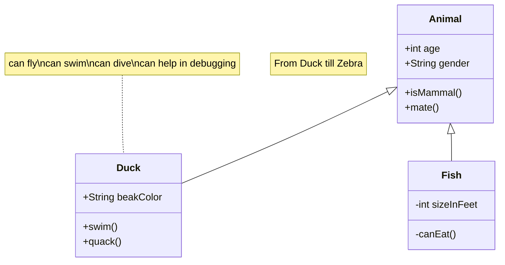
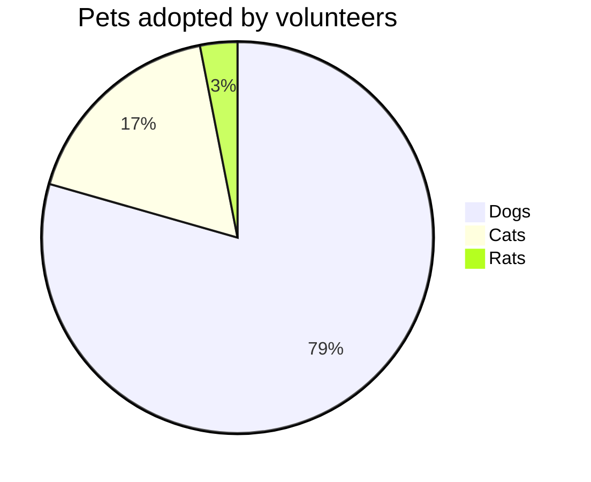
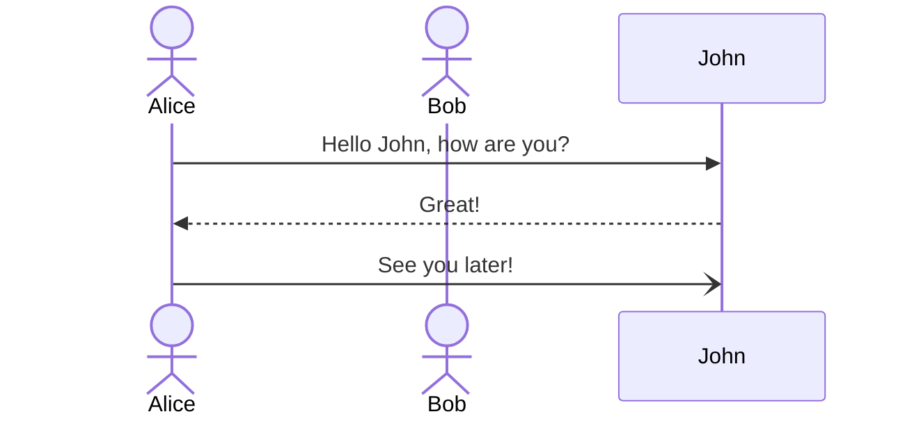
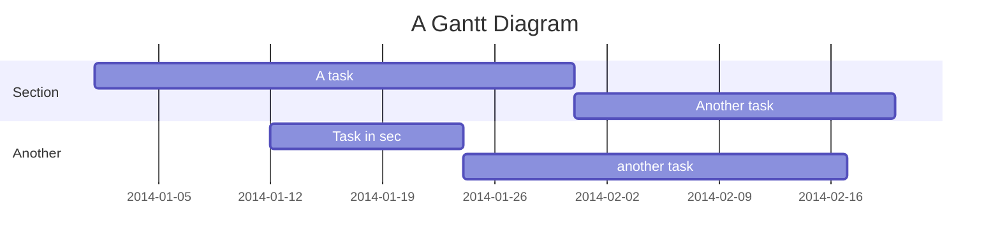
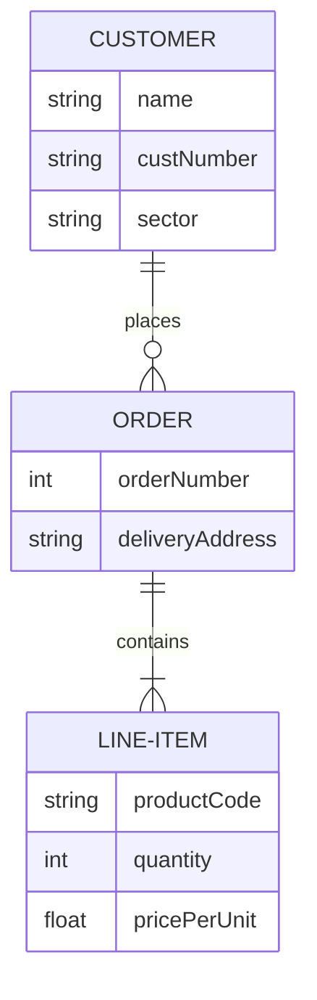

# mermaid

## 流程图

`TD`/`TB`上下，`LR`左右

## [[UML]]类图

|  Type   |  Description  |
| :-----: | :-----------: |
| `<\|--` |  Inheritance  |
| `\*--`  |  Composition  |
|  `o--`  |  Aggregation  |
|  `-->`  |  Association  |
|  `--`   | Link (Solid)  |
|  `..>`  |  Dependency   |
| `..\|>` |  Realization  |
|  `..`   | Link (Dashed) |

## 饼图

## 时序图

## 甘特图

## ER 图

[[数据库]]中常用

[//begin]: # "Autogenerated link references for markdown compatibility"
[UML]: UML.md "UML类图"
[数据库]: ../database/数据库.md "数据库"
[//end]: # "Autogenerated link references"
