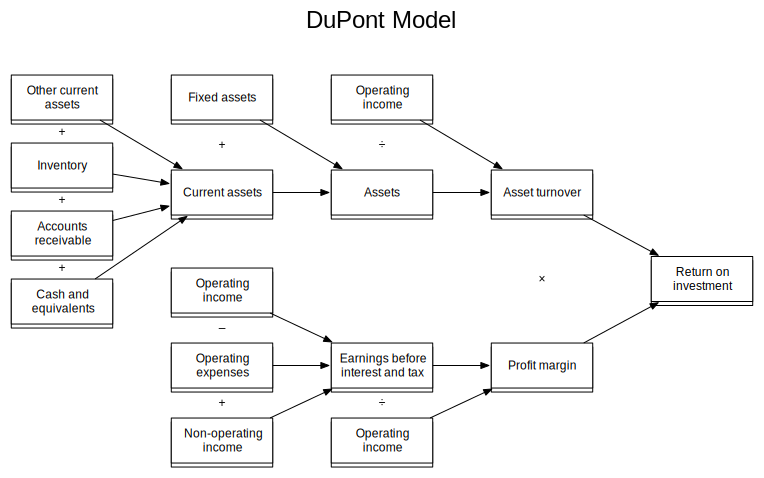

# 杜邦分析法

净资产收益率 = (净利 ÷ 营业收入) × (营业收入 ÷ 资产) × (资产 ÷ 股东权益)

分析企业财务状况的方法，将 ROE 拆解为净利润率、资产周转率、财务杠杆三个因素的乘积，其中净利润率可以进一步拆解为

- NI/PreTaxIncome
- PreTaxIncome/EBIT
- EBIT/Revenue

净利润率反应了企业的经营效率，资产周转率反应了企业的资产管理效率，财务杠杆反应了企业的资本结构。
通过分析这三个因素，可以了解不同企业的[[财务会计]]

[//begin]: # "Autogenerated link references for markdown compatibility"
[财务会计]: accounting/财务会计.md "财务会计"
[//end]: # "Autogenerated link references"
