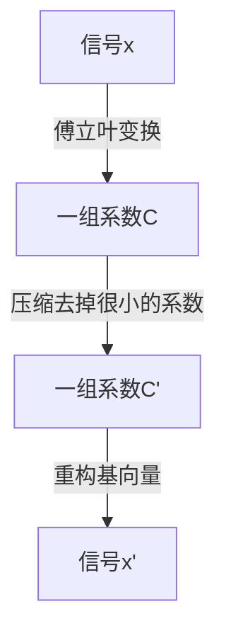

# 复数矩阵

## [[矩阵运算]]

对复数向量$z$，有

- $z^H$：共轭转置
- $|z|^2=z^H\cdot z=\bar{z}^T\cdot z$
- $x\cdot y=x^Hy$

对复数矩阵$A$，有

- $A^H$：共轭转置
- 埃米尔特矩阵(对称矩阵)：$A^H=A$
- 酉矩阵(正交矩阵)：$A^HA=AA^H=I$

## [[快速傅立叶变换]]

### 傅立叶矩阵

形式为

$$
F_{N}=\frac{1}{\sqrt{N}}\begin{bmatrix}
1 & 1 & \cdots & 1 \\
1 & \omega & \cdots & \omega^{N-1} \\
\vdots & \vdots & \ddots & \vdots \\
1 & \omega^{N-1} & \cdots & \omega^{(N-1)(N-1)}
\end{bmatrix}
$$

其中$\omega=e^{-2\pi i/N}$

### 傅立叶矩阵之间的关系

快速傅立叶之所以快，是因为它是通过傅立叶矩阵的乘法来实现的，下式中的$D$是一个对角矩阵，其对角线上的元素是$\omega^k$，$P$是一个置换矩阵，将奇偶行分开减小计算量

$$
F_{2N}=
\begin{bmatrix}
I & D \\
I & -D
\end{bmatrix}
\begin{bmatrix}
F_{N} & 0 \\
0 & F_{N}
\end{bmatrix}
\begin{bmatrix}
P
\end{bmatrix}
$$

$n$阶矩阵的计算量从$n^2$降到了$\frac{n}{2}\log_2n$

### 图像压缩

jpeg 格式将图像分块，再使用傅里叶基进行变换，流程是

